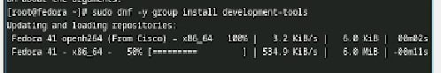

---
## Front matter
lang: ru-RU
title:  Лабораторная работа №1
subtitle: Установка и настройка ОС
author:
  - Устинова В. В.
institute:
  - Российский университет дружбы народов, Москва, Россия
date: 03 март 2025

## i18n babel
babel-lang: russian
babel-otherlangs: english

## Formatting pdf
toc: false
toc-title: Содержание
slide_level: 2
aspectratio: 169
section-titles: true
theme: metropolis
header-includes:
 - \metroset{progressbar=frametitle,sectionpage=progressbar,numbering=fraction}
---

# Информация

## Докладчик

:::::::::::::: {.columns align=center}
::: {.column width="70%"}

  * Устинова Виктория Вадимовна
  * студент НПИбд-01-24
  * Российский университет дружбы народов

:::
::: {.column width="30%"}

:::
::::::::::::::

## Цели

Целью данной работы является приобретение практических навыков установки операционной системы на виртуальную машину, настройки минимально необходимых для дальнейшей работы сервисов.

## Задание

Установить операционную систему
Обновить пакетов
Выполнить автоматическое обновление
Отключить SELinux
Настроить раскладку клавиатуры
Установить имя пользователя и названия хоста
Работа с языком разметки Markdown
Устиноваить texlive
Домашнее задание

## Установка операционной системы

Установка операционной системы

{#fig:001 width=70%}

## После установки

Войдите в ОС под заданной вами при установке учётной записью и Переключитесь на роль супер-пользователя

{#fig:002 width=70%}

## Обновления

Установите средства разработки

{#fig:003 width=70%}

Обновить все пакеты

{#fig:004 width=70%}

## Повышение комфорта работы

Программы для удобства работы в консоли и другой вариант консоли

{#fig:005 width=70%}

## Автоматическое обновление

Установка программного обеспечения

## Автоматическое обновление

{#fig:006 width=70%}

## Автоматическое обновление

Запустите таймер

{#fig:007 width=70%}

## Отключение SELinux

Отключение SELinu, переходим в файл /etc/selinux/config

{#fig:008 width=70%}

В файле /etc/selinux/config замените значение

{#fig:009 width=70%}

## Отключение SELinux

{#fig:010 width=70%}

## Настройка раскладки клавиатуры

Создайте конфигурационный файл ~/.config/sway/config.d/95-system-keyboard-config.conf

{#fig:011 width=70%}

Отредактируйте конфигурационный файл

{#fig:012 width=70%}

## Настройка раскладки клавиатуры

Переключитесь на роль супер-пользователя и отредактируйте другой файл /etc/X11/xorg.conf.d/00-keyboard.conf

{#fig:013 width=70%}

## Настройка раскладки клавиатуры

Редактируем файл

{#fig:014 width=70%}

## Установка имени пользователя и названия хоста

Установите имя хоста

{#fig:015 width=70%}

Проверьте, что имя хоста установлено верно

{#fig:016 width=70%}

## Работа с языком разметки Markdown

Установка с помощью менеджера пакетов pandoc

{#fig:017 width=70%}

## Работа с языком разметки Markdown

Переходим по ссылке и находим в гитхабе нужный нам файл

{#fig:018 width=70%}

## Работа с языком разметки Markdown

Распакуйте архивы

{#fig:019 width=70%}

## Texlive

Установим дистрибутив TeXlive

{#fig:020 width=70%}

## Домашнее задание

В окне терминала проанализируйте последовательность загрузки системы, выполнив команду dmesg.Получите следующую информацию.Версия ядра Linux (Linux version).

{#fig:021 width=70%}

## Домашнее задание

Получите следующую информацию.Частота процессора (Detected Mhz processor).Модель процессора (CPU0).

{#fig:022 width=70%}

## Домашнее задание

Получите следующую информацию.Объём доступной оперативной памяти (Memory available).
Тип обнаруженного гипервизора (Hypervisor detected).
Тип файловой системы корневого раздела.
Последовательность монтирования файловых систем.

{#fig:023 width=70%}

# Выводы

У нас получилось приобрести практические навыкы установки операционной системы на виртуальную машину и навыки настройки минимально необходимых для дальнейшей работы сервисов.

