---
## Front matter
title: "лабораторная работа №1"
subtitle: "Отчет"
author: "Устинова Виктория Вадимовна"

## Generic otions
lang: ru-RU
toc-title: "Содержание"

## Bibliography
bibliography: bib/cite.bib
csl: pandoc/csl/gost-r-7-0-5-2008-numeric.csl

## Pdf output format
toc: true # Table of contents
toc-depth: 2
lof: true # List of figures
lot: true # List of tables
fontsize: 12pt
linestretch: 1.5
papersize: a4
documentclass: scrreprt
## I18n polyglossia
polyglossia-lang:
  name: russian
  options:
	- spelling=modern
	- babelshorthands=true
polyglossia-otherlangs:
  name: english
## I18n babel
babel-lang: russian
babel-otherlangs: english
## Fonts
mainfont: IBM Plex Serif
romanfont: IBM Plex Serif
sansfont: IBM Plex Sans
monofont: IBM Plex Mono
mathfont: STIX Two Math
mainfontoptions: Ligatures=Common,Ligatures=TeX,Scale=0.94
romanfontoptions: Ligatures=Common,Ligatures=TeX,Scale=0.94
sansfontoptions: Ligatures=Common,Ligatures=TeX,Scale=MatchLowercase,Scale=0.94
monofontoptions: Scale=MatchLowercase,Scale=0.94,FakeStretch=0.9
mathfontoptions:
## Biblatex
biblatex: true
biblio-style: "gost-numeric"
biblatexoptions:
  - parentracker=true
  - backend=biber
  - hyperref=auto
  - language=auto
  - autolang=other*
  - citestyle=gost-numeric
## Pandoc-crossref LaTeX customization
figureTitle: "Рис."
tableTitle: "Таблица"
listingTitle: "Листинг"
lofTitle: "Список иллюстраций"
lotTitle: "Список таблиц"
lolTitle: "Листинги"
## Misc options
indent: true
header-includes:
  - \usepackage{indentfirst}
  - \usepackage{float} # keep figures where there are in the text
  - \floatplacement{figure}{H} # keep figures where there are in the text
---

# Цель работы

Целью данной работы является приобретение практических навыков установки операционной системы на виртуальную машину, настройки минимально необходимых для дальнейшей работы сервисов.

# Задание

Установить операционную систему
Обновить пакетов
Выполнить автоматическое обновление
Отключить SELinux
Настроить раскладку клавиатуры
Установить имя пользователя и названия хоста
Работа с языком разметки Markdown
Устиноваить texlive
Домашнее задание

# Выполнение лабораторной работы

Установка операционной системы(рис. [-@fig:001]).

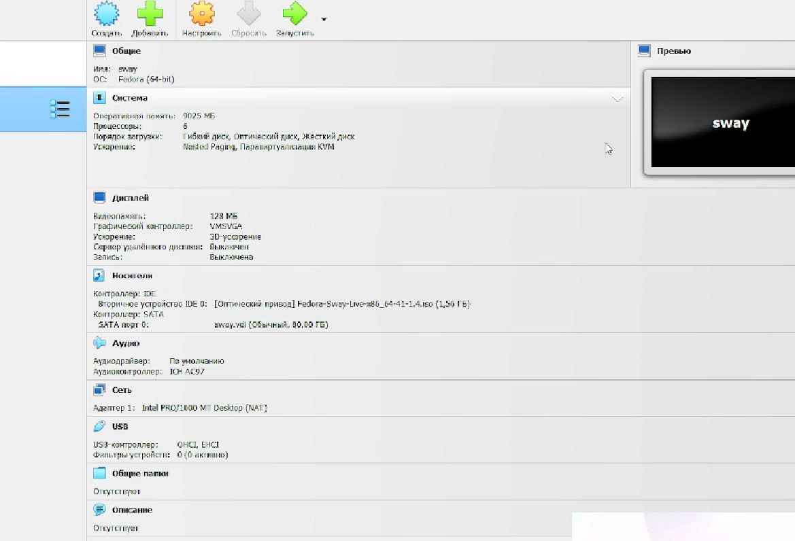{#fig:001 width=70%}

Войдите в ОС под заданной вами при установке учётной записью и Переключитесь на роль супер-пользователя:.(рис. [-@fig:002]).

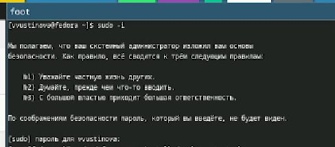{#fig:002 width=70%}

Установите средства разработки(рис. [-@fig:003]).

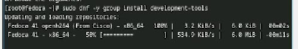{#fig:003 width=70%}

Обновить все пакеты(рис. [-@fig:004]).

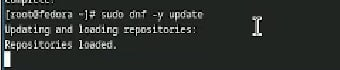{#fig:004 width=70%}

Программы для удобства работы в консоли и другой вариант консоли(рис. [-@fig:005]).

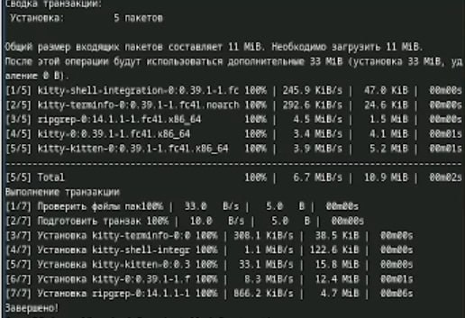{#fig:005 width=70%}

Установка программного обеспечения(рис. [-@fig:006]).

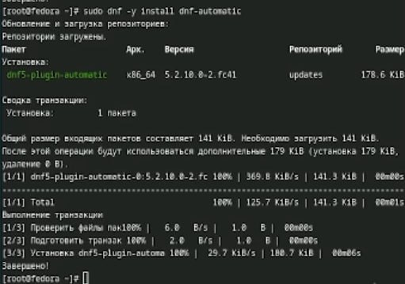{#fig:006 width=70%}

Запустите таймер(рис. [-@fig:007]).

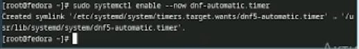{#fig:007 width=70%}

Отключение SELinu, переходим в файл /etc/selinux/config(рис. [-@fig:008]).

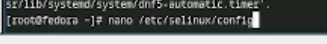{#fig:008 width=70%}

В файле /etc/selinux/config замените значение(рис. [-@fig:009]).

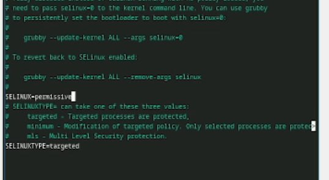{#fig:009 width=70%}

Перегрузите виртуальную машину(рис. [-@fig:010]).

{#fig:010 width=70%}

Создайте конфигурационный файл ~/.config/sway/config.d/95-system-keyboard-config.conf(рис. [-@fig:011]).

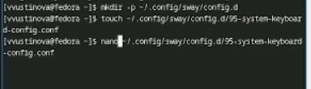{#fig:011 width=70%}

Отредактируйте конфигурационный файл(рис. [-@fig:012]).

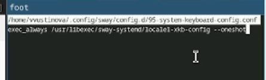{#fig:012 width=70%}

Переключитесь на роль супер-пользователя и отредактируйте другой файл /etc/X11/xorg.conf.d/00-keyboard.conf(рис. [-@fig:013]).

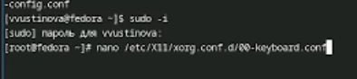{#fig:013 width=70%}

Редактируем файл(рис. [-@fig:014]).

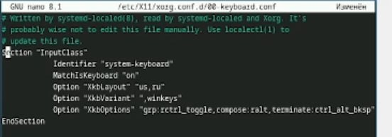{#fig:014 width=70%}

Установите имя хоста(рис. [-@fig:015]).

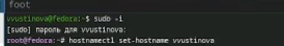{#fig:015 width=70%}

Проверьте, что имя хоста установлено верно(рис. [-@fig:016]).

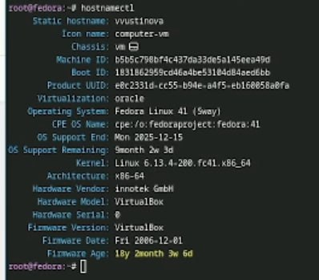{#fig:016 width=70%}

Установка с помощью менеджера пакетов pandoc(рис. [-@fig:017]).

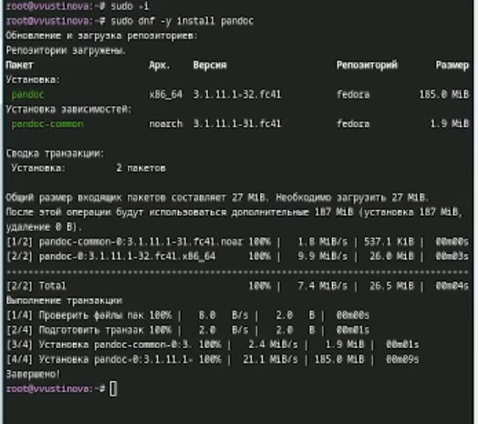{#fig:017 width=70%}

Переходим по ссылке и находим в гитхабе нужный нам файл(рис. [-@fig:018]).

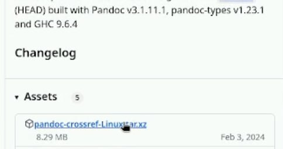{#fig:018 width=70%}

Распакуйте архивы(рис. [-@fig:019]).

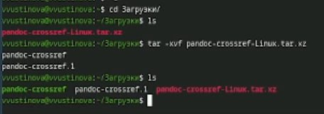{#fig:019 width=70%}

Установим дистрибутив TeXlive(рис. [-@fig:020]).

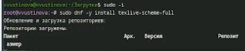{#fig:020 width=70%}

В окне терминала проанализируйте последовательность загрузки системы, выполнив команду dmesg.Получите следующую информацию.Версия ядра Linux (Linux version).(рис. [-@fig:021]).

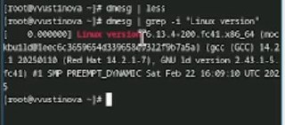{#fig:021 width=70%}

Получите следующую информацию.Частота процессора (Detected Mhz processor).Модель процессора (CPU0).(рис. [-@fig:022]).

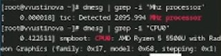{#fig:022 width=70%}

Получите следующую информацию.Объём доступной оперативной памяти (Memory available).
Тип обнаруженного гипервизора (Hypervisor detected).
Тип файловой системы корневого раздела.
Последовательность монтирования файловых систем.(рис. [-@fig:023]).

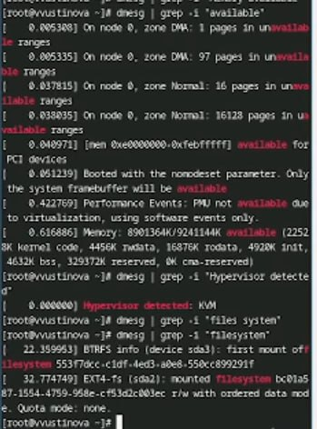{#fig:023 width=70%}

# Контольные вопросы

1. Имя пользователя (Username), Идентификатор пользователя (User ID - UID), Домашняя директория (Home Directory),командная оболочка (Shell), пароль.
2. help, ls, du -sh /home.., mkdir,rmdir,touch,rm,chmod,history
3. Файловая система – это способ организации и хранения файлов на устройстве хранения (жестком диске, SSD, USB-накопителе и т.д.). Она определяет структуру данных, используемую для хранения информации о файлах (имена, размеры, даты изменения, права доступа) и их содержимом. Файловая система отвечает за организацию пространства на диске и предоставление интерфейса для доступа к файлам.ext4 (Fourth Extended Filesystem),  XFS ,  Btrfs.
4. Для просмотра списка подмонтированных файловых систем можно использовать следующие команды:mount (без аргументов)Выводит подробную информацию о всех подмонтированных файловых системах, включая устройство, точку монтирования, тип файловой системы и опции монтирования.df -h: Выводит информацию о занятом и свободном месте на дисках, а также показывает точки монтирования и типы файловых систем.  Флаг -h делает вывод в "человекочитаемом" формате.lsblk:  Выводит информацию о блочных устройствах (дисках, разделах, RAID-массивах), показывая точки монтирования.
5. Чтобы убить зависший процесс Firefox 1.ps aux | grep firefox (или pgrep firefox) - найдите PID процесса Firefox.2.kill <PID> (где <PID> - найденный PID).3.Если процесс не завершается, попробуйте kill -9 <PID>.

# Выводы

У нас получилось приобрести практические навыкы установки операционной системы на виртуальную машину и навыки настройки минимально необходимых для дальнейшей работы сервисов.

