---
## Front matter
lang: ru-RU
title: Лабораторная работа №3
subtitle: Markdowm
author:
  - Устинова В. В.
institute:
  - Российский университет дружбы народов, Москва, Россия
date: 02 февраля 2025

## i18n babel
babel-lang: russian
babel-otherlangs: english

## Formatting pdf
toc: false
toc-title: Содержание
slide_level: 2
aspectratio: 169
section-titles: true
theme: metropolis
header-includes:
 - \metroset{progressbar=frametitle,sectionpage=progressbar,numbering=fraction}
---

# Информация

## Докладчик

:::::::::::::: {.columns align=center}
::: {.column width="70%"}

  * Устинова Виктория Вадимовна
  * студент НПИбд-01-24
  * Российский университет дружбы народов

:::
::: {.column width="30%"}

:::
::::::::::::::

## Цели

Изучить идеологию и применение средств контроля версий.
Освоить умения по работе с git.

## Задачи
- Создать базовую конфигурацию для работы с git.
- Создать ключ SSH.
- Создать ключ PGP.
- Настроить подписи git.
- Зарегистрироваться на Github.
- Создать локальный каталог для выполнения заданий по предмету.

# Установка git и установка gh

Установка программного обеспечения git и gh

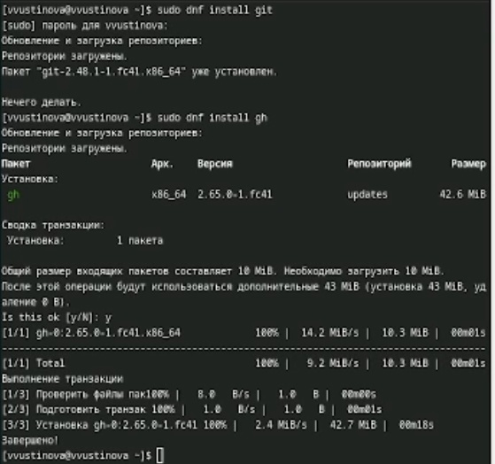{#fig:001 width=70%}

## Базовая настройка git

Зададим имя и email владельца репозитория и настроим utf-8 в выводе сообщений git

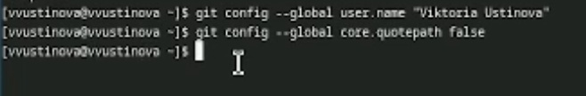{#fig:002 width=70%}

Зададим имя начальной ветки (будем называть её master)

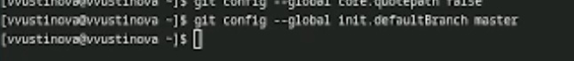{#fig:003 width=70%}

Параметр autocrlf и параметр safecrlf

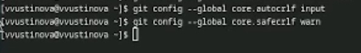{#fig:004 width=70%}

## Создание ключей ssh

Создаем клюс ssh по алгоритму rsa с ключём размером 4096 бит

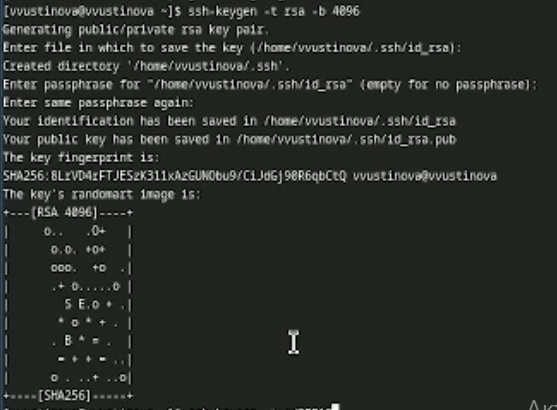{#fig:005 width=70%}

Создаем клюс ssh по алгоритму ed25519

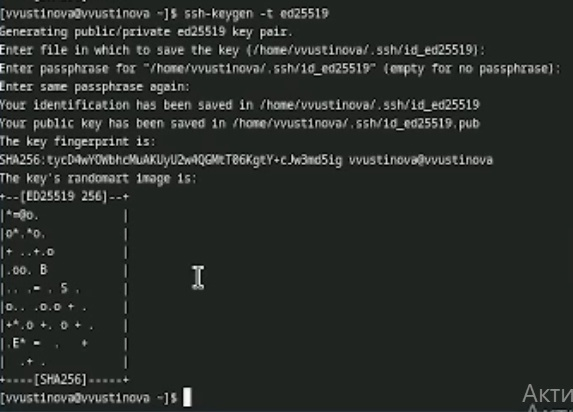{#fig:006 width=70%}

## Создание ключей pgp

Генерируем ключ pgp

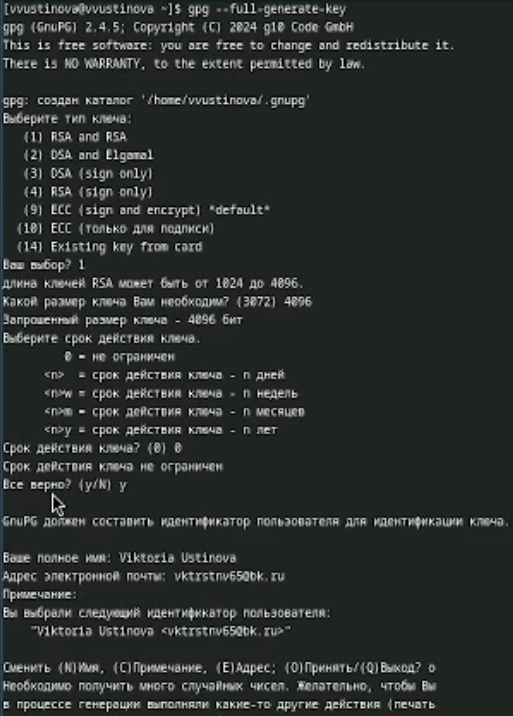{#fig:007 width=70%}

## Добавление PGP ключа в GitHub

Выводим список ключей и копируем отпечаток приватного ключа

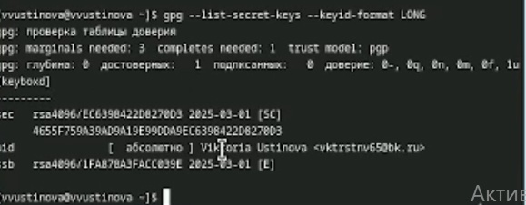{#fig:008 width=70%}

Cкопируйте ваш сгенерированный PGP ключ в буфер обмена

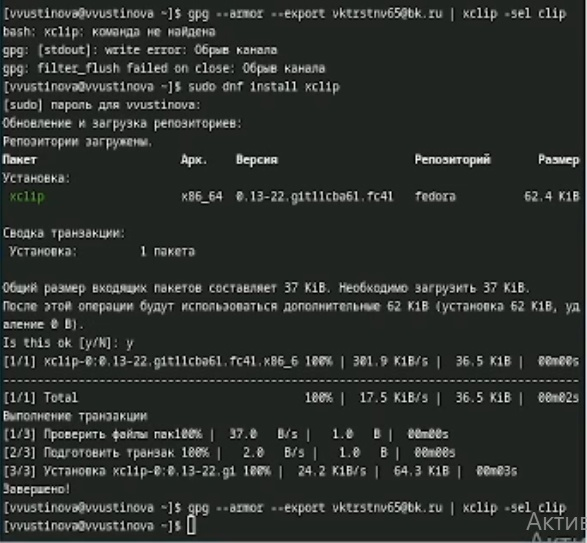{#fig:009 width=70%}

Переходим в гитхаб и находим gpg ключ

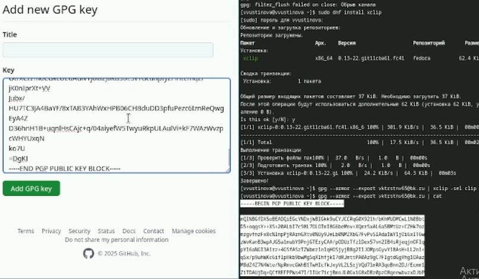{#fig:010 width=70%}

## Настройка автоматических подписей коммитов git

Используя введёный email, укажите Git применять его при подписи коммитов

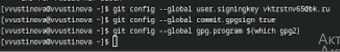{#fig:011 width=70%}

## Настройка gh

Для начала необходимо авторизоваться

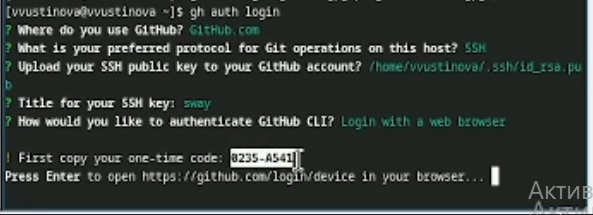{#fig:012 width=70%}

Копируем код,выделенный на предыдущем фото и вставляем в окно

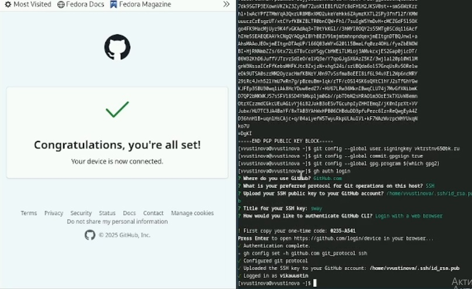{#fig:013 width=70%}

## Сознание репозитория курса на основе шаблона

Необходимо создать шаблон рабочего пространства

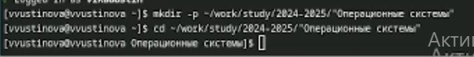{#fig:014 width=70%}

Создаем репозиторий и клонируем все на гитхаб

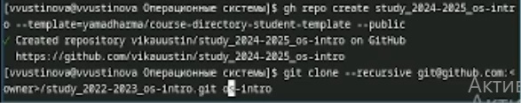{#fig:015 width=70%}

## Настройка каталога курса

Переходим в каталог курса и создаем необходимые каталоги

{#fig:016 width=70%}

Отправляем все файлы на гитхаб

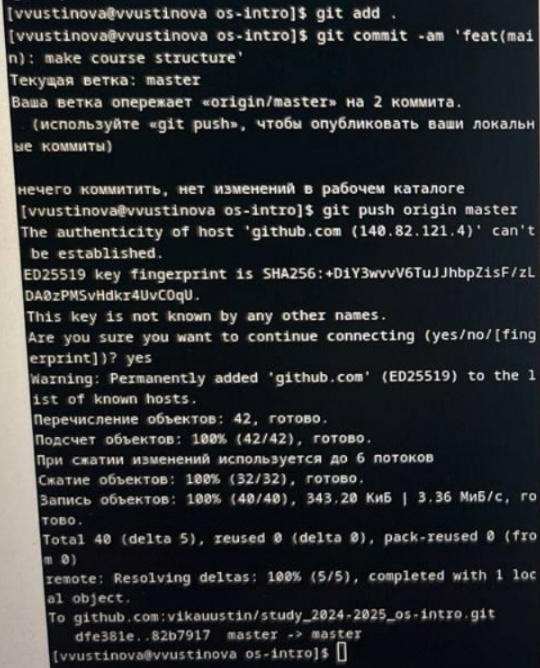{#fig:017 width=70%}

# Выводы

У нас получилось изучить идеологию и применение средств контроля версий и освоить умения по работе с git. 

