---
## Front matter
title: "Лаборатораня работа №2"
subtitle: "Отчет"
author: "Устинова Виктория Вадимовна"

## Generic otions
lang: ru-RU
toc-title: "Содержание"

## Bibliography
bibliography: bib/cite.bib
csl: pandoc/csl/gost-r-7-0-5-2008-numeric.csl

## Pdf output format
toc: true # Table of contents
toc-depth: 2
lof: true # List of figures
lot: true # List of tables
fontsize: 12pt
linestretch: 1.5
papersize: a4
documentclass: scrreprt
## I18n polyglossia
polyglossia-lang:
  name: russian
  options:
	- spelling=modern
	- babelshorthands=true
polyglossia-otherlangs:
  name: english
## I18n babel
babel-lang: russian
babel-otherlangs: english
## Fonts
mainfont: IBM Plex Serif
romanfont: IBM Plex Serif
sansfont: IBM Plex Sans
monofont: IBM Plex Mono
mathfont: STIX Two Math
mainfontoptions: Ligatures=Common,Ligatures=TeX,Scale=0.94
romanfontoptions: Ligatures=Common,Ligatures=TeX,Scale=0.94
sansfontoptions: Ligatures=Common,Ligatures=TeX,Scale=MatchLowercase,Scale=0.94
monofontoptions: Scale=MatchLowercase,Scale=0.94,FakeStretch=0.9
mathfontoptions:
## Biblatex
biblatex: true
biblio-style: "gost-numeric"
biblatexoptions:
  - parentracker=true
  - backend=biber
  - hyperref=auto
  - language=auto
  - autolang=other*
  - citestyle=gost-numeric
## Pandoc-crossref LaTeX customization
figureTitle: "Рис."
tableTitle: "Таблица"
listingTitle: "Листинг"
lofTitle: "Список иллюстраций"
lotTitle: "Список таблиц"
lolTitle: "Листинги"
## Misc options
indent: true
header-includes:
  - \usepackage{indentfirst}
  - \usepackage{float} # keep figures where there are in the text
  - \floatplacement{figure}{H} # keep figures where there are in the text
---

# Цель работы

Изучить идеологию и применение средств контроля версий.
Освоить умения по работе с git.

# Задание

Создать базовую конфигурацию для работы с git.
Создать ключ SSH.
Создать ключ PGP.
Настроить подписи git.
Зарегистрироваться на Github.
Создать локальный каталог для выполнения заданий по предмету.

# Выполнение лабораторной работы

Установка программного обеспечения git и gh(рис. [-@fig:001]).

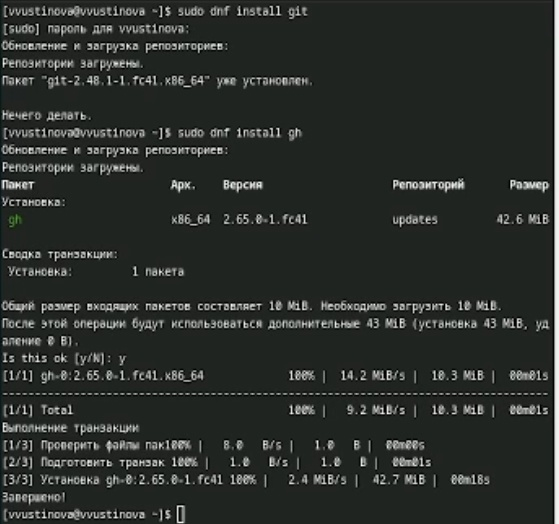{#fig:001 width=70%}

Зададим имя и email владельца репозитория и настроим utf-8 в выводе сообщений git(рис. [-@fig:002]).

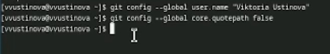{#fig:002 width=70%}

Зададим имя начальной ветки (будем называть её master)(рис. [-@fig:003]).

{#fig:003 width=70%}

Параметр autocrlf и параметр safecrlf(рис. [-@fig:004]).

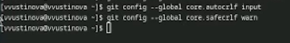{#fig:004 width=70%}

Создаем клюс ssh по алгоритму rsa с ключём размером 4096 бит(рис. [-@fig:005]).

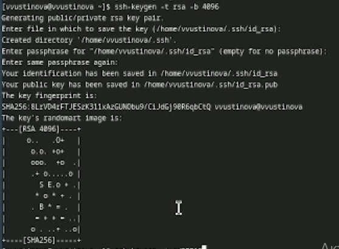{#fig:005 width=70%}

Создаем клюс ssh по алгоритму ed25519(рис. [-@fig:006]).

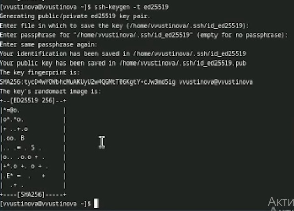{#fig:006 width=70%}

Генерируем ключ pgp(рис. [-@fig:007]).

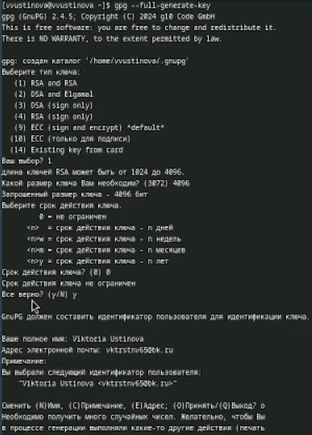{#fig:007 width=70%}

Выводим список ключей и копируем отпечаток приватного ключа(рис. [-@fig:008]).

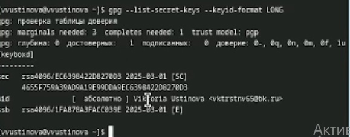{#fig:008 width=70%}

Cкопируйте ваш сгенерированный PGP ключ в буфер обмена(рис. [-@fig:009]).

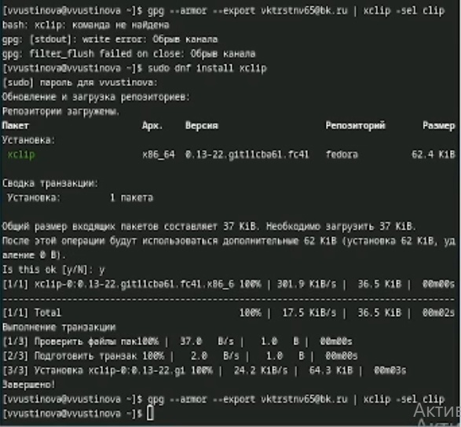{#fig:009 width=70%}

Переходим в гитхаб и находим gpg ключ(рис. [-@fig:010]).

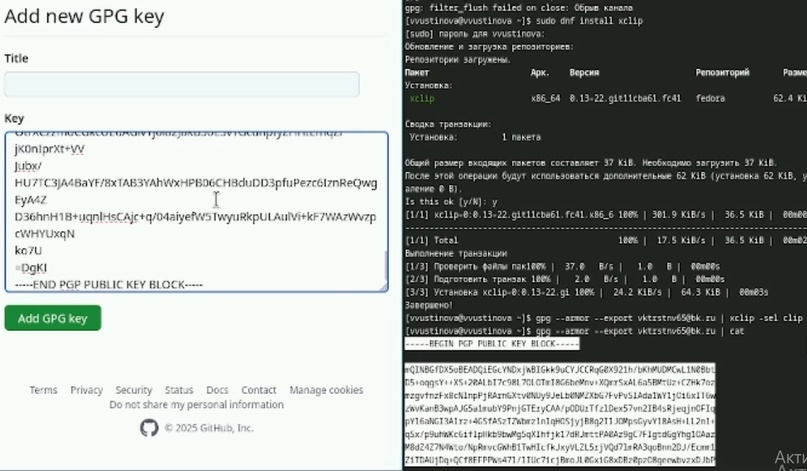{#fig:010 width=70%}

Используя введёный email, укажите Git применять его при подписи коммитов(рис. [-@fig:011]).

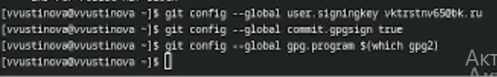{#fig:011 width=70%}

Для начала необходимо авторизоваться(рис. [-@fig:012]).

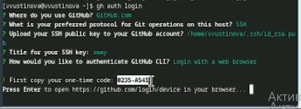{#fig:012 width=70%}

Копируем код,выделенный на предыдущем фото и вставляем в окно(рис. [-@fig:013]).

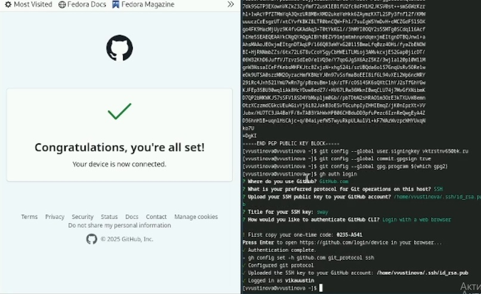{#fig:013 width=70%}

Необходимо создать шаблон рабочего пространства(рис. [-@fig:014]).

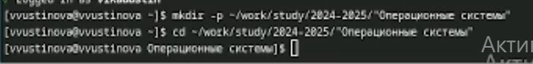{#fig:014 width=70%}

Создаем репозиторий и клонируем все на гитхаб(рис. [-@fig:015]).

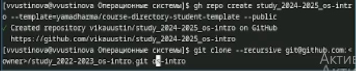{#fig:015 width=70%}

Переходим в каталог курса и создаем необходимые каталоги(рис. [-@fig:016]).

{#fig:016 width=70%}

Отправляем все файлы на гитхаб(рис. [-@fig:017]).

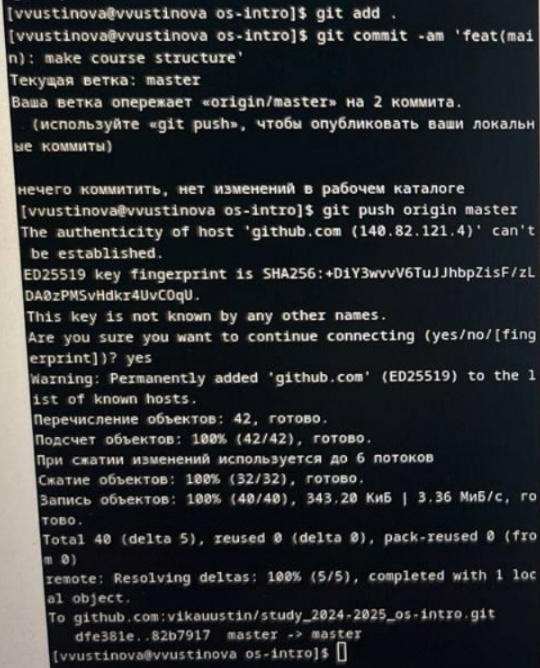{#fig:017 width=70%}

# Выводы

У нас получилось изучить идеологию и применение средств контроля версий и освоить умения по работе с git. 

# Ответы на контольные вопросы

1. Система контроля версий (Version Control System, VCS) – это инструмент, который отслеживает изменения в наборе файлов с течением времени. Представьте себе возможность вернуться к любой предыдущей версии документа, программы или веб-сайта, посмотреть, кто, когда и почему внес изменения. 
2. VCS позволяет нескольким разработчикам работать над одним проектом одновременно.Если что-то пошло не так, VCS позволяет быстро вернуться к более ранней версии файла или всего проекта.VCS позволяет создавать отдельные ветки разработки, чтобы экспериментировать с новыми функциями или исправлять ошибки, не затрагивая основную линию разработки.Хранилище (Repository): Это центральное место, где хранится вся история проекта.Commit: Это фиксация набора изменений в хранилище. История (History): Это последовательность всех commit-ов, выполненных в проекте, упорядоченных во времени. История позволяет видеть эволюцию проекта и отслеживать все изменения.Рабочая копия (Working Copy): Это локальная копия файлов проекта на компьютере разработчика. 
3. Централизованные VCS: В централизованных VCS есть одно центральное хранилище, где хранится вся история проекта. Разработчики получают рабочую копию из этого хранилища, вносят изменения и отправляют их обратно в центральное хранилище. Примеры: Subversion (SVN), CVS.Децентрализованные VCS: В децентрализованных VCS каждый разработчик имеет полную копию хранилища со всей историей проекта. Разработчики могут работать независимо друг от друга и обмениваться изменениями напрямую, минуя центральный сервер.Примеры: Git, Mercurial.
4. 1. Инициализация хранилища: Создается новое хранилище для проекта (например, с помощью git init).2. Добавление файлов: Файлы проекта добавляются в область отслеживания VCS.3. Фиксация изменений (commit): Внесенные изменения фиксируются в хранилище с комментарием, описы
я, удаляются. 4. Повторение шагов 3 и 4:  Процесс внесения изменений и их фиксации повторяется по мере необходимости. 5. Просмотр истории:  Просматривается история изменений, чтобы понять, что и когда было изменено. 6. Возврат к предыдущим версиям:  При необходимости выполняется возврат к одной из предыдущих версий файла или проекта.
5. 1. Клонирование хранилища: Разработчик клонирует удаленное хранилище на свой компьютер, создавая локальную рабочую копию. 2. Создание ветки (branch): (Опционально) Создается отдельная ветка для внесения изменений, чтобы не затрагивать основную линию разработки. 3. Внесение изменений:  Разработчик вносит изменения в локальную рабочую копию. 4. Фиксация изменений (commit):  Изменения фиксируются в локальном хранилище. 5. Отправка изменений (push):  Локальные изменения отправляются в удаленное хранилище (обычно в свою ветку). 6. Создание запроса на слияние (pull request):  Разработчик создает запрос на слияние своих изменений из ветки в основную ветку. 7. Обзор изменений (code review): Другие разработчики просматривают изменения и оставляют комментарии. 8. Слияние изменений (merge): После одобрения изменений они сливаются в основную ветку. 9. Разрешение конфликтов: Если при слиянии возникают конфликты (например, два разработчика изменили один и тот же участок кода), они разрешаются вручную. 10. Синхронизация (pull):  Разработчик получает последние изменения из удаленного хранилища в свою локальную рабочую копию.
6. Основные задачи, решаемые Git:
• Контроль версий: Git отслеживает изменения в файлах и позволяет возвращаться к предыдущим версиям.
• Совместная работа.
• Ветвление и слияние: Git позволяет создавать отдельные ветки разработки для экспериментов и исправления ошибок, а затем сливать эти ветки обратно в основную линию разработки.
• Распределенная разработка: Git - это децентрализованная VCS, поэтому каждый разработчик имеет полную копию хранилища.
7. Основные команды Git:git init: Инициализирует новый Git-репозиторий.git clone <url>: Клонирует существующий Git-репозиторий с удаленного сервера.git add <file>: Добавляет файлы в область подготовки (staging area).git commit -m "Сообщение": Фиксирует изменения из области подготовки в локальном репозитории.git status: Показывает текущий статус файлов в репозитории.git branch: Управляет ветками (создание, удаление, переключение).git push <remote> <branch>: Отправляет локальные коммиты в удаленный репозиторий.git pull <remote> <branch>: Получает изменения из удаленного репозитория и сливает их в текущую ветку.
git revert: Создает новый коммит, отменяющий изменения из предыдущего коммита.
git stash: Временно сохраняет изменения в рабочей директории, чтобы переключиться на другую ветку.
8. Локальный: mkdir my_project
cd my_project
git init
Создаем файл hello.txt
echo "Hello, world!" > hello.txt
Добавляем файл в область подготовки
git add hello.txt
Фиксируем изменения
git commit -m "Initial commit: Added hello.txt"
Удаленный:git remote add origin <url_репозитория_на_git> Отправляем локальную ветку master в удаленную ветку master
git push origin master
Клонируем репозиторий с GitHub
git clone <url_репозитория_на_git>
9. Ветвь – это указатель на определенный commit в истории проекта. Ветви позволяют работать над разными функциями или исправлениями ошибок параллельно, не затрагивая основную линию разработки. Зачем нужны ветви:
1.Изоляция изменений.
2.Параллельная разработка. каждая в своей ветке.
3.Эксперименты.
4.Подготовка к релизу.
10. Зачем это нужно
1.Очистка репозитория: Предотвращает засорение репозитория ненужными файлами.
2.Безопасность: Предотвращает попадание конфиденциальных данных (например, паролей) в репозиторий.
3.Производительность: Уменьшает размер репозитория и ускоряет операции Git.
