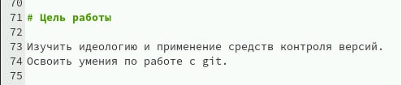
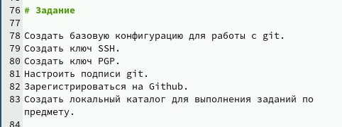
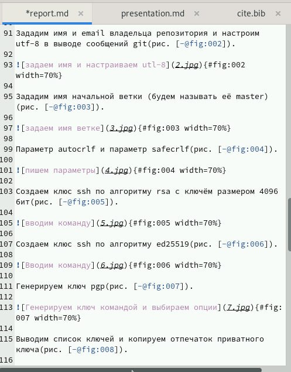
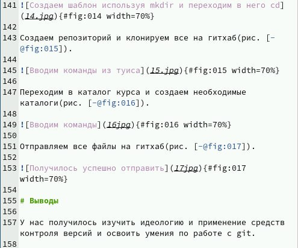
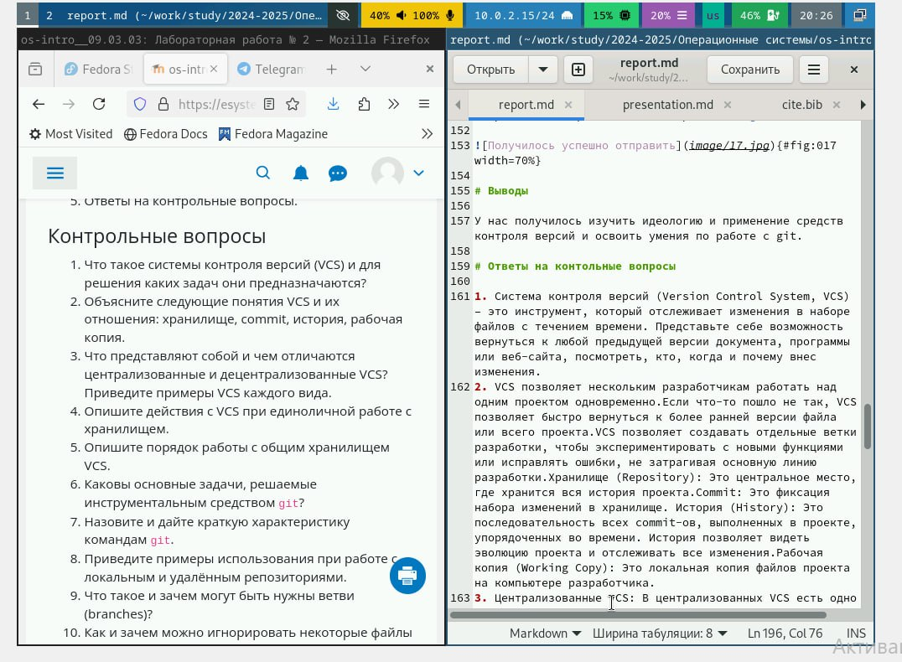
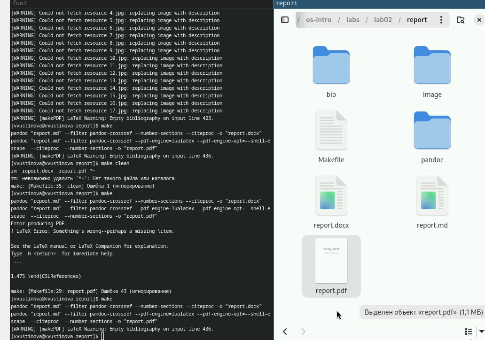
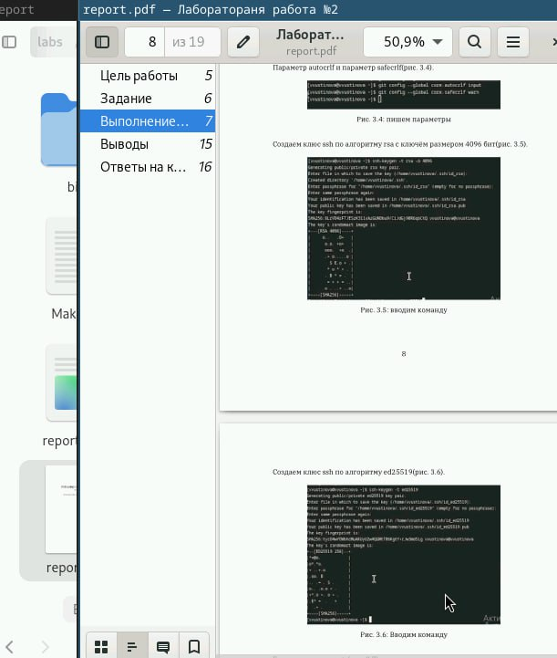

---
## Front matter
lang: ru-RU
title: Лабораторная работа №3
subtitle: Отчет лабораторной №2
author:
  - Устинова В. В.
institute:
  - Российский университет дружбы народов, Москва, Россия
date: 02 марта 2025

## i18n babel
babel-lang: russian
babel-otherlangs: english

## Formatting pdf
toc: false
toc-title: Содержание
slide_level: 2
aspectratio: 169
section-titles: true
theme: metropolis
header-includes:
 - \metroset{progressbar=frametitle,sectionpage=progressbar,numbering=fraction}
---

# Информация

## Докладчик

:::::::::::::: {.columns align=center}
::: {.column width="70%"}

  * Устинова Виктория Вадимовна
  * студент НПИбд-01-24
  * Российский университет дружбы народов

:::
::: {.column width="30%"}

:::
::::::::::::::
## Цели

Научиться оформлять отчёты с помощью легковесного языка разметки Markdown

## Задачи

Оформить лабораторную работу №2 в формате Markdown

## Выполнение лабораторной работы

Оформляем основные данные

{#fig:001 width=70%}

##Цель

Цель работы

{#fig:002 width=70%}

## Задания

Копируем здания из лабораторной

{#fig:003 width=70%}

## Основная часть

Выполняем основную часть

{#fig:004 width=70%}

## Вывод

Выводы

{#fig:005 width=70%}

## Контрольные вопросы

Ответы на вопросы

{#fig:006 width=70%}

## Команда make

Переходим в каталог и пишем команду make

{#fig:007 width=70%}

## Все создано

Переходим на файл

{#fig:008 width=70%}

## Выводы

Мы научились оформлять отчёты с помощью легковесного языка разметки Markdown и успешно сделали в нем лабораторную работу №2

