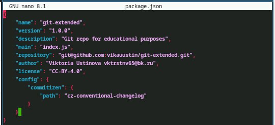

---
## Front matter
lang: ru-RU
title: Лабораторная работа №4
subtitle: Настройка git
author:
  - Устинова В. В.
institute:
  - Российский университет дружбы народов, Москва, Россия
date: 03 март 2025

## i18n babel
babel-lang: russian
babel-otherlangs: english

## Formatting pdf
toc: false
toc-title: Содержание
slide_level: 2
aspectratio: 169
section-titles: true
theme: metropolis
header-includes:
 - \metroset{progressbar=frametitle,sectionpage=progressbar,numbering=fraction}
---

# Информация

## Докладчик

:::::::::::::: {.columns align=center}
::: {.column width="70%"}

  * Устинова Виктория Вадимовна
  * студент НПИбд-01-24
  * Российский университет дружбы народов

:::
::: {.column width="30%"}

:::
::::::::::::::

## Цель работы

Получение навыков правильной работы с репозиториями git.

## Задание

Выполнить работу для тестового репозитория.
Преобразовать рабочий репозиторий в репозиторий с git-flow и conventional commits.

## Установка программного обеспечения

Установка git-flow

{#fig:001 width=70%}

## Установка Node.js

Установка Node.js 

{#fig:002 width=70%}

Установка Node.js

{#fig:003 width=70%}

## Настройка Node.js

Для работы с Node.js добавим каталог с исполняемыми файлами, устанавливаемыми yarn, в переменную PATH.Запустите:pnpm setup и перелогиньтесь

{#fig:004 width=70%}

## Общепринятые коммиты

Данная программа используется для помощи в форматировании коммитов

{#fig:005 width=70%}

## Общепринятые коммиты

Данная программа используется для помощи в создании логов.

{#fig:006 width=70%}

## Практический сценарий использования git

Создаем репозиторий в гитхабе git-extended

{#fig:007 width=70%}

## Создание репозитория git

Делаем первый коммит и выкладываем на github 

{#fig:008 width=70%}

## Конфигурация общепринятых коммитов

Конфигурация для пакетов Node.js

{#fig:009 width=70%}

## Конфигурация общепринятых коммитов

Сконфигурим формат коммитов. Для этого добавим в файл package.json команду для формирования коммитов 

{#fig:010 width=70%}

## Добавление файлов

Добавим новые файлы и выполним коммит

{#fig:011 width=70%}

## Отправление файлов

Отправляем файлы на гитхаб

{#fig:012 width=70%}

## Kонфигурация git-flow

Инициализируем git-flow и префикс для ярлыков установим v.

{#fig:013 width=70%}

## Kонфигурация git-flow

Проверьте, что Вы на ветке develop и загрузите весь репозиторий в хранилище

{#fig:014 width=70%}

## Kонфигурация git-flow

Установите внешнюю ветку как вышестоящую для этой ветки и создадим релиз с версией 1.0.0

{#fig:015 width=70%}

## Kонфигурация git-flow

Создадим журнал изменений и добавим журнал изменений в индекс, а также зальём релизную ветку в основную ветку

{#fig:016 width=70%}

## Kонфигурация git-flow

Отправим данные на github и создадим релиз на github. Для этого будем использовать утилиты работы с github 

{#fig:017 width=70%}

## Работа с репозиторием git

Создадим ветку для новой функциональности и объединяем ветку feature_branch c develop

{#fig:018 width=70%}

## Создание релиза git-flow

Coздадим релиз с версией 1.2.3 и откроем редактор

{#fig:019 width=70%}

## Создание релиза git-flow

Создадим журнал изменений, добавим журнал изменений в индекс и зальём релизную ветку в основную ветку

{#fig:020 width=70%}

## Создание релиза git-flow

Отправим данные на github 

{#fig:021 width=70%}

# Выводы

У нас получилось получить навыкы правильной работы с репозиториями git.

