---
## Front matter
title: "Лабораторная работа №4"
subtitle: "Отчет"
author: "Устинова Виктория Вадимовна"

## Generic otions
lang: ru-RU
toc-title: "Содержание"

## Bibliography
bibliography: bib/cite.bib
csl: pandoc/csl/gost-r-7-0-5-2008-numeric.csl

## Pdf output format
toc: true # Table of contents
toc-depth: 2
lof: true # List of figures
lot: true # List of tables
fontsize: 12pt
linestretch: 1.5
papersize: a4
documentclass: scrreprt
## I18n polyglossia
polyglossia-lang:
  name: russian
  options:
	- spelling=modern
	- babelshorthands=true
polyglossia-otherlangs:
  name: english
## I18n babel
babel-lang: russian
babel-otherlangs: english
## Fonts
mainfont: IBM Plex Serif
romanfont: IBM Plex Serif
sansfont: IBM Plex Sans
monofont: IBM Plex Mono
mathfont: STIX Two Math
mainfontoptions: Ligatures=Common,Ligatures=TeX,Scale=0.94
romanfontoptions: Ligatures=Common,Ligatures=TeX,Scale=0.94
sansfontoptions: Ligatures=Common,Ligatures=TeX,Scale=MatchLowercase,Scale=0.94
monofontoptions: Scale=MatchLowercase,Scale=0.94,FakeStretch=0.9
mathfontoptions:
## Biblatex
biblatex: true
biblio-style: "gost-numeric"
biblatexoptions:
  - parentracker=true
  - backend=biber
  - hyperref=auto
  - language=auto
  - autolang=other*
  - citestyle=gost-numeric
## Pandoc-crossref LaTeX customization
figureTitle: "Рис."
tableTitle: "Таблица"
listingTitle: "Листинг"
lofTitle: "Список иллюстраций"
lotTitle: "Список таблиц"
lolTitle: "Листинги"
## Misc options
indent: true
header-includes:
  - \usepackage{indentfirst}
  - \usepackage{float} # keep figures where there are in the text
  - \floatplacement{figure}{H} # keep figures where there are in the text
---

# Цель работы

Получение навыков правильной работы с репозиториями git.

# Задание

Выполнить работу для тестового репозитория.
Преобразовать рабочий репозиторий в репозиторий с git-flow и conventional commits.

## Выполнение лабораторной работы

Установка git-flow(рис. [-@fig:001]).

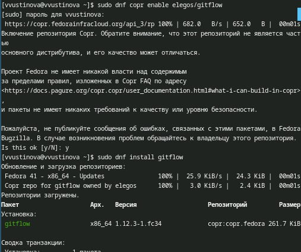{#fig:001 width=70%}

Установка Node.js (рис. [-@fig:002]).

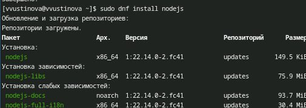{#fig:002 width=70%}

Установка Node.js рис. [-@fig:003]).

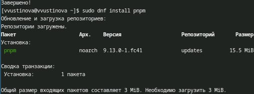{#fig:003 width=70%}

Для работы с Node.js добавим каталог с исполняемыми файлами, устанавливаемыми yarn, в переменную PATH.Запустите:pnpm setup и перелогиньтесь(рис. [-@fig:004]).

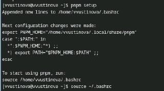{#fig:004 width=70%}

Данная программа используется для помощи в форматировании коммитов.(рис. [-@fig:005]).

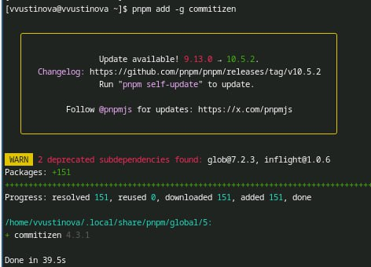{#fig:005 width=70%}

Данная программа используется для помощи в создании логов.(рис. [-@fig:006]).

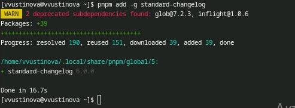{#fig:006 width=70%}

Создаем репозиторий в гитхабе git-extended(рис. [-@fig:007]).

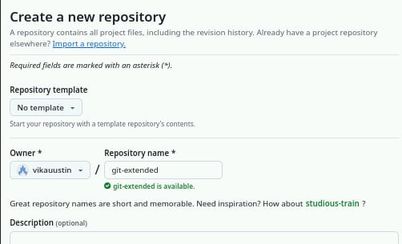{#fig:007 width=70%}

Делаем первый коммит и выкладываем на github (рис. [-@fig:008]).

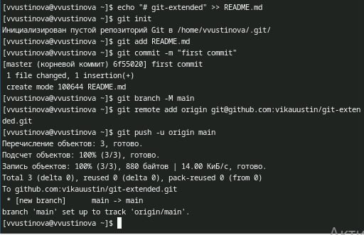{#fig:008 width=70%}

Конфигурация для пакетов Node.js (рис. [-@fig:009]).

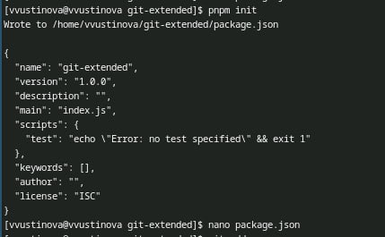{#fig:009 width=70%}

Сконфигурим формат коммитов. Для этого добавим в файл package.json команду для формирования коммитов (рис. [-@fig:010]).

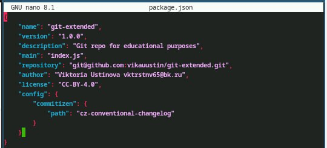{#fig:010 width=70%}

Добавим новые файлы и выполним коммит(рис. [-@fig:011]).

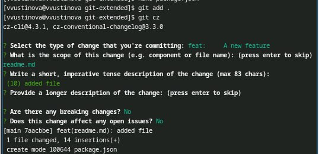{#fig:011 width=70%}

Отправляем файлы на гитхаб(рис. [-@fig:012]).

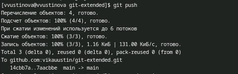{#fig:012 width=70%}

Инициализируем git-flow и префикс для ярлыков установим в v.(рис. [-@fig:013]).

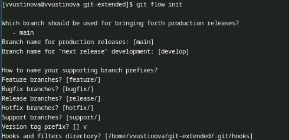{#fig:013 width=70%}

Проверьте, что Вы на ветке develop и загрузите весь репозиторий в хранилище (рис. [-@fig:014]).

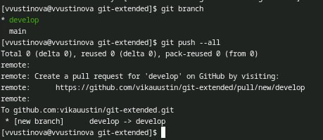{#fig:014 width=70%}

Установите внешнюю ветку как вышестоящую для этой ветки и создадим релиз с версией 1.0.0(рис. [-@fig:015]).

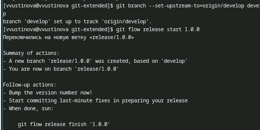{#fig:015 width=70%}

Создадим журнал изменений и добавим журнал изменений в индекс, а также зальём релизную ветку в основную ветку(рис. [-@fig:016]).

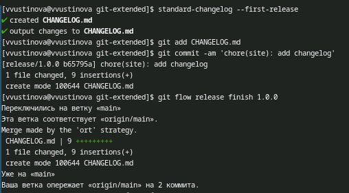{#fig:016 width=70%}

Отправим данные на github и создадим релиз на github. Для этого будем использовать утилиты работы с github (рис. [-@fig:017]).

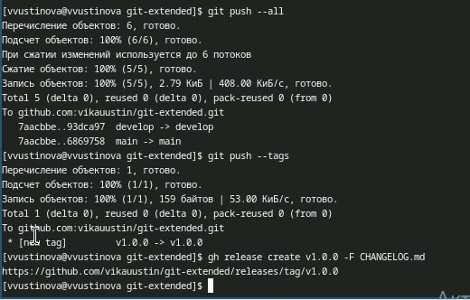{#fig:017 width=70%}

Создадим ветку для новой функциональности и объединяем ветку feature_branch c develop(рис. [-@fig:018]).

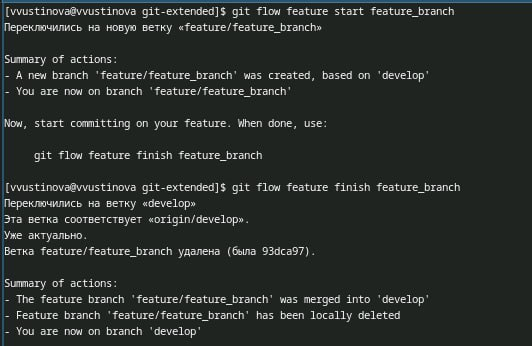{#fig:018 width=70%}

оздадим релиз с версией 1.2.3 и откроем редактор(рис. [-@fig:019]).

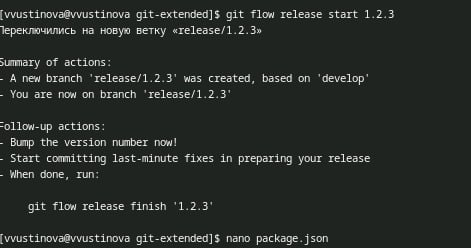{#fig:019 width=70%}

Создадим журнал изменений, добавим журнал изменений в индекс и зальём релизную ветку в основную ветку(рис. [-@fig:020]).

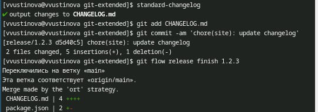{#fig:020 width=70%}

Отправим данные на github (рис. [-@fig:021]).

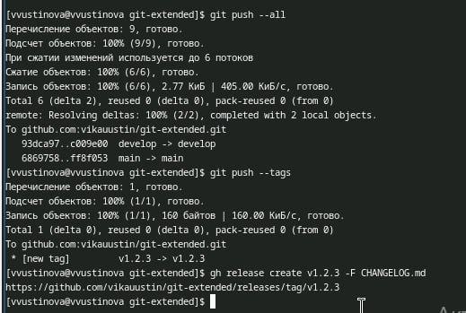{#fig:021 width=70%}

# Выводы

У нас получилось получить навыкы правильной работы с репозиториями git.

