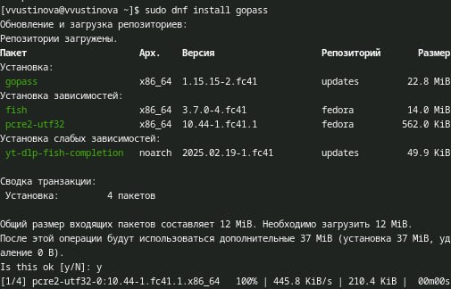

---
## Front matter
lang: ru-RU
title: Лабораторная работа №5
subtitle: Презентация
author:
 - Устинова В. В.
institute:
  - Российский университет дружбы народов, Москва, Россия
date: 14 марта 2025

## i18n babel
babel-lang: russian
babel-otherlangs: english

## Formatting pdf
toc: false
toc-title: Содержание
slide_level: 2
aspectratio: 169
section-titles: true
theme: metropolis
header-includes:
 - \metroset{progressbar=frametitle,sectionpage=progressbar,numbering=fraction}
---

# Информация

## Докладчик

:::::::::::::: {.columns align=center}
::: {.column width="70%"}

  * Устинова Виктория Вадимовна
  * студент НПИбд-01-24
  * Российский университет дружбы народов

:::
::: {.column width="30%"}

:::
::::::::::::::

## Цель работы

Научится настраивать рабочую среду.

## Задание

Менеджер паролей pass
Настройка интерфейса с броузером
Сохранение пароля
Дополнительное программное обеспечение
Создание собственного репозитория с помощью утилит
Подключение репозитория к своей системе
Использование chezmoi на нескольких машинах
Настройка новой машины с помощью одной команды
Ежедневные операции c chezmoi

## Менеджер паролей pass

Устанавливаем менеджер паролей pass

{#fig:001 width=70%}

## Менеджер паролей pass

Устанавливаем менеджер паролей pass следубщая команда

{#fig:002 width=70%}

## Настройка gpg

Просмотр списка ключей и инициализируем хранилище

{#fig:003 width=70%}

## Настройка gpg

Предварительно создаем репозиторий pass и нужно задать адрес репозитория на хостинге, выполняем комнаду pass git pull

{#fig:004 width=70%}

## Настройка gpg

Для синхронизации выполняется следующая команда

{#fig:005 width=70%}

## Настройка gpg

Переходим в cd ~/.password-store/ и необходимо вручную закоммитить и выложить изменения

{#fig:006 width=70%}

## Настройка интерфейса с броузером

Кроме плагина к броузеру устанавливается программа, обеспечивающая интерфейс native messaging.

{#fig:007 width=70%}

## Сохранение пароля

Создаем новый файл, и устанавливаем для него пароль

{#fig:008 width=70%}

## Просмотр и создание нового пароля

Отобразите пароль для указанного имени файла и замените существующий пароль

{#fig:009 width=70%}

## Дополнительное программное обеспечение

Установите дополнительное программное обеспечение

{#fig:010 width=70%}

## Дополнительное программное обеспечение(шрифты)

Установите шрифты

{#fig:011 width=70%}

## Установка бинарного файла, coздание собственного репозитория

Установка бинарного файла, создание репозитория для конфигурационных файлов и инициализируйте chezmoi с моим репозиторием dotfiles

{#fig:012 width=70%}

## Подключение репозитория к своей системе

Проверьте, какие изменения внесёт chezmoi в домашний каталог

{#fig:013 width=70%}

## Использование chezmoi на нескольких машинах

Можно установить свои dotfiles на новый компьютер с помощью одной команды

{#fig:014 width=70%}

## Настройка новой машины с помощью одной команды

Можно извлечь изменения из репозитория и применить их одной командой, и извлеките последние изменения из своего репозитория 

{#fig:015 width=70%}

## Выводы

У нас получилось настроить рабочую среду.

