---
## Front matter
lang: ru-RU
title: Лабораторная работа №6
subtitle: Презентация
author:
 - Устинова В. В.
institute:
  - Российский университет дружбы народов, Москва, Россия
date: 16 марта 2025

## i18n babel
babel-lang: russian
babel-otherlangs: english

## Formatting pdf
toc: false
toc-title: Содержание
slide_level: 2
aspectratio: 169
section-titles: true
theme: metropolis
header-includes:
 - \metroset{progressbar=frametitle,sectionpage=progressbar,numbering=fraction}
---

# Информация

## Докладчик

:::::::::::::: {.columns align=center}
::: {.column width="70%"}

  * Устинова Виктория Вадимовна
  * студент НПИбд-01-24
  * Российский университет дружбы народов
:::
::: {.column width="30%"}

:::
::::::::::::::

## Цель работы

Приобретение практических навыков взаимодействия пользователя с системой по-средством командной строки.

## Задание

Выполняем задания, связанные с командной строкой поочередно.

## Домашний каталог

Определите полное имя вашего домашнего каталога.Перейдите в каталог /tmp.Выведите на экран содержимое каталога /tmp. Для этого используйте команду ls с различными опциями. 

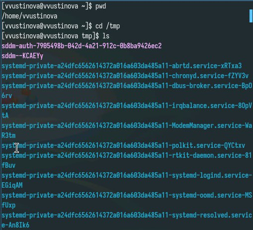{#fig:001 width=70%}

## Опции ls 

Поясните разницу в выводимой на экран информации.

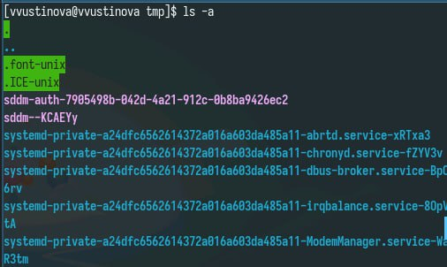{#fig:002 width=70%}

## Опции ls 

Поясните разницу в выводимой на экран информации.

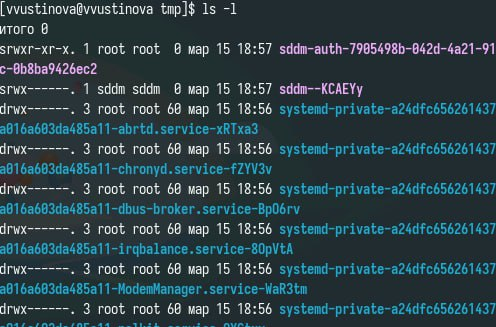{#fig:003 width=70%}

## Опредлелить с помощью ls 

Определите, есть ли в каталоге /var/spool подкаталог с именем cron

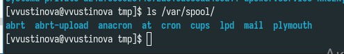{#fig:004 width=70%}

## Создание и удаление каталогов

В домашнем каталоге создайте новый каталог с именем newdir. В каталоге ~/newdir создайте новый каталог с именем morefun.

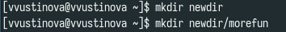{#fig:005 width=70%}

## Создание и удаление каталогов

В домашнем каталоге создайте одной командой три новых каталога с именами letters, memos, misk. Затем удалите эти каталоги одной командой.

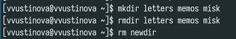{#fig:006 width=70%}

## Создание и удаление каталогов

Удалите каталог ~/newdir/morefun из домашнего каталога

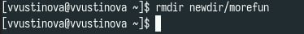{#fig:007 width=70%}

## Опции ls

Какую опцию команды ls нужно использовать для просмотра содержимое не только указанного каталога, но и подкаталогов,входящих в него.

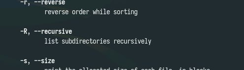{#fig:008 width=70%}

## Опции ls

С помощью команды man определите набор опций команды ls, позволяющий отсортировать по времени последнего изменения выводимый список содержимого каталога с развёрнутым описанием файлов.

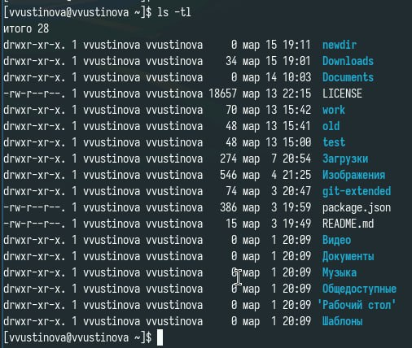{#fig:009 width=70%}

## Команда men 

Используйте команду man для просмотра описания команды cd

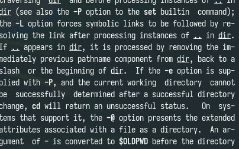{#fig:010 width=70%}

## Команда men 

Используйте команду man для просмотра описания команды pwd

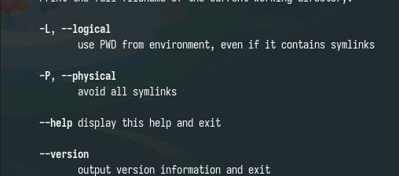{#fig:011 width=70%}

## Команда men 

Используйте команду man для просмотра описания команды mkdir

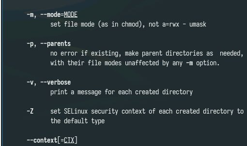{#fig:012 width=70%}

## Команда men 

Используйте команду man для просмотра описания команды rmdir

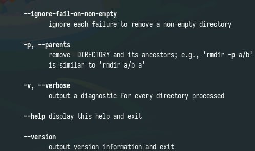{#fig:013 width=70%}

## Команда men 

Используйте команду man для просмотра описания команды rmd

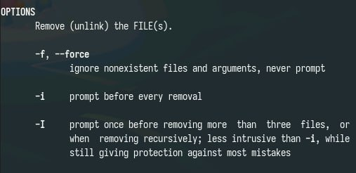{#fig:014 width=70%}

## Команда history

Используя информацию, полученную при помощи команды history, выполните модификацию и исполнение нескольких команд из буфера команд.

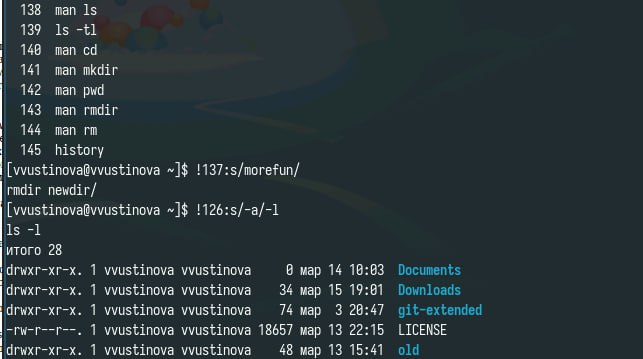{#fig:015 width=70%}

## Выводы

У нас получилось приобрести практические навыки взаимодействия пользователя с системой по-средством командной строки.

