---
## Front matter
title: "Лабораторная работа №6"
subtitle: "Отчет"
author: "Устинова Виктория Вадимовна"

## Generic otions
lang: ru-RU
toc-title: "Содержание"

## Bibliography
bibliography: bib/cite.bib
csl: pandoc/csl/gost-r-7-0-5-2008-numeric.csl

## Pdf output format
toc: true # Table of contents
toc-depth: 2
lof: true # List of figures
lot: true # List of tables
fontsize: 12pt
linestretch: 1.5
papersize: a4
documentclass: scrreprt
## I18n polyglossia
polyglossia-lang:
  name: russian
  options:
	- spelling=modern
	- babelshorthands=true
polyglossia-otherlangs:
  name: english
## I18n babel
babel-lang: russian
babel-otherlangs: english
## Fonts
mainfont: IBM Plex Serif
romanfont: IBM Plex Serif
sansfont: IBM Plex Sans
monofont: IBM Plex Mono
mathfont: STIX Two Math
mainfontoptions: Ligatures=Common,Ligatures=TeX,Scale=0.94
romanfontoptions: Ligatures=Common,Ligatures=TeX,Scale=0.94
sansfontoptions: Ligatures=Common,Ligatures=TeX,Scale=MatchLowercase,Scale=0.94
monofontoptions: Scale=MatchLowercase,Scale=0.94,FakeStretch=0.9
mathfontoptions:
## Biblatex
biblatex: true
biblio-style: "gost-numeric"
biblatexoptions:
  - parentracker=true
  - backend=biber
  - hyperref=auto
  - language=auto
  - autolang=other*
  - citestyle=gost-numeric
## Pandoc-crossref LaTeX customization
figureTitle: "Рис."
tableTitle: "Таблица"
listingTitle: "Листинг"
lofTitle: "Список иллюстраций"
lotTitle: "Список таблиц"
lolTitle: "Листинги"
## Misc options
indent: true
header-includes:
  - \usepackage{indentfirst}
  - \usepackage{float} # keep figures where there are in the text
  - \floatplacement{figure}{H} # keep figures where there are in the text
---

# Цель работы

Приобретение практических навыков взаимодействия пользователя с системой по-средством командной строки.

# Задание

Выполняем задания, связанные с командной строкой поочередно.

# Выполнение лабораторной работы

Определите полное имя вашего домашнего каталога.Перейдите в каталог /tmp.Выведите на экран содержимое каталога /tmp. Для этого используйте команду ls с различными опциями. (рис. [-@fig:001]).

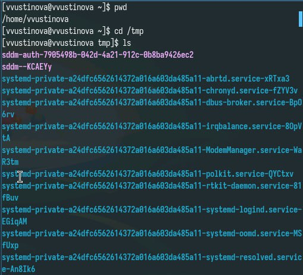{#fig:001 width=70%}

Поясните разницу в выводимой на экран информации.(рис. [-@fig:002]).

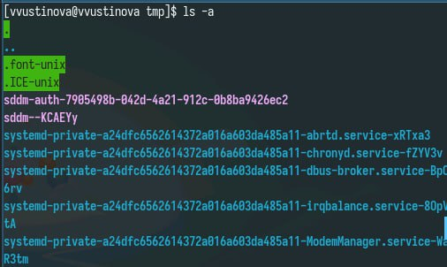{#fig:002 width=70%}

Поясните разницу в выводимой на экран информации.(рис. [-@fig:003]).

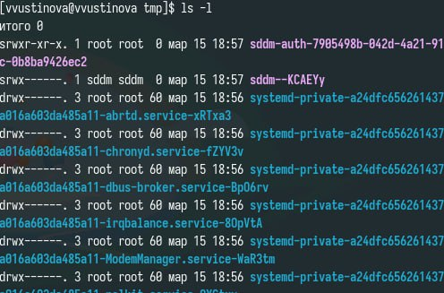{#fig:003 width=70%}

пределите, есть ли в каталоге /var/spool подкаталог с именем cron(рис. [-@fig:004]).

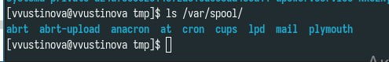{#fig:004 width=70%}

В домашнем каталоге создайте новый каталог с именем newdir. В каталоге ~/newdir создайте новый каталог с именем morefun.(рис. [-@fig:005]).

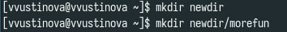{#fig:005 width=70%}

В домашнем каталоге создайте одной командой три новых каталога с именами letters, memos, misk. Затем удалите эти каталоги одной командой.(рис. [-@fig:006]).

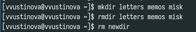{#fig:006 width=70%}

Удалите каталог ~/newdir/morefun из домашнего каталога(рис. [-@fig:007]).

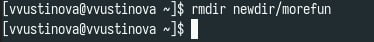{#fig:007 width=70%}

Какую опцию команды ls нужно использовать для просмотра содержимое не только указанного каталога, но и подкаталогов,входящих в него.(рис. [-@fig:008]).

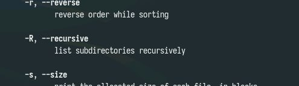{#fig:008 width=70%}

С помощью команды man определите набор опций команды ls, позволяющий отсортировать по времени последнего изменения выводимый список содержимого каталога с развёрнутым описанием файлов.(рис. [-@fig:009]).

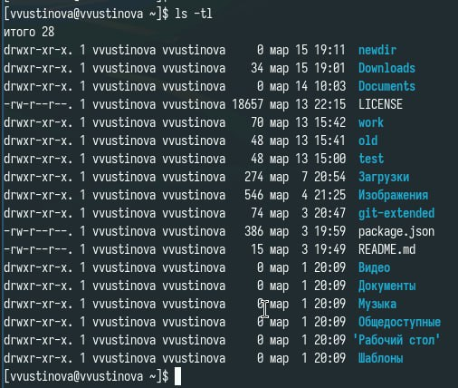{#fig:009 width=70%}

Используйте команду man для просмотра описания команды cd(рис. [-@fig:010]).

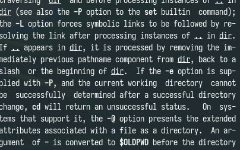{#fig:010 width=70%}

Используйте команду man для просмотра описания команды pwd(рис. [-@fig:011]).

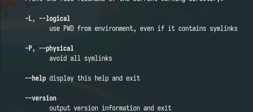{#fig:011 width=70%}

Используйте команду man для просмотра описания команды mkdir(рис. [-@fig:012]).

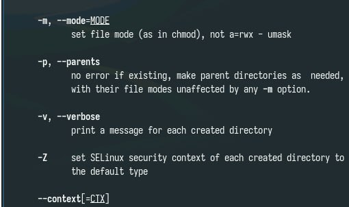{#fig:012 width=70%}

Используйте команду man для просмотра описания команды rmdir(рис. [-@fig:013]).

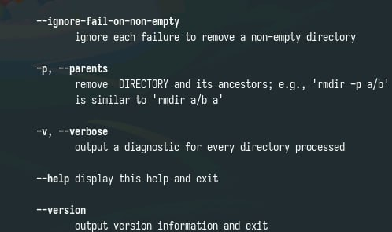{#fig:013 width=70%}

Используйте команду man для просмотра описания команды rmd(рис. [-@fig:014]).

{#fig:014 width=70%}

Используя информацию, полученную при помощи команды history, выполните модификацию и исполнение нескольких команд из буфера команд.(рис. [-@fig:015]).

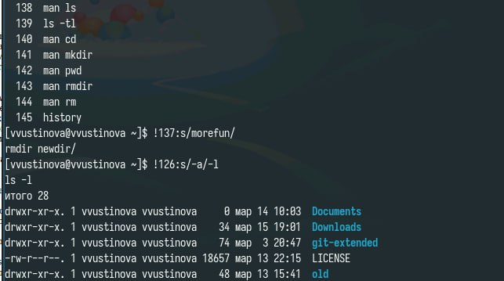{#fig:015 width=70%}

# Выводы

Приобретение практических навыков взаимодействия пользователя с системой по-средством командной строки.

# Ответы на контрольные вопросы

1. Командная строка: Интерфейс, позволяющий взаимодействовать с операционной системой посредством текстовых команд.
2. Абсолютный путь: pwd. Пример: pwd (вывод: /home/user/Documents).
3. Тип файлов и имена: ls -l. Пример: ls -l (первый символ в каждой строке показывает тип файла: - - файл, d - каталог, l - символическая ссылка). 
4. Скрытые файлы: ls -a (показать все файлы, включая скрытые), ls -la (показать все файлы, включая скрытые, и подробную информацию).
5. Файл: rm filename Каталог: rmdir dirname (только пустой каталог), rm -r dirname (для непустых каталогов).Одной командой нельзя гарантированно удалить и файл, и каталог.
6. История команд: history.
7. !(номер команды):s/(что меняем)/(на что меняем)
8. Несколько команд в одной строке: Разделитель ;.  Пример: cd Documents; ls -l.  Для условного выполнения
9.  Экранирование: Символы, используемые для подавления специального значения других символов. Пример: \* экранирует символ *, чтобы он не интерпретировался как подстановочный знак. \ экранирует пробел в имени файла: my\ file.txt.
10.  ls -l вывод: Отображает подробную информацию о файлах и каталогах: права доступа, количество жестких ссылок, владелец, группа, размер в байтах, дата и время последнего изменения, имя файла.
11.  Относительный путь: Путь от текущего каталога. Пример: Если вы находитесь в /home/user, то путь Documents/myfile.txt является относительным. Абсолютный путь: /home/user/Documents/myfile.txt.  Команда с относительным путем: cat Documents/myfile.txt. Команда с абсолютным путем: cat /home/user/Documents/myfile.txt.
12. Информация о команде: man command_name (открывает руководство), command_name --help (если поддерживается, выводит краткую справку). Пример: man ls, ls --help.

