---
## Front matter
lang: ru-RU
title: Лабораторная работа №7
subtitle: Презентация
author:
 - Устинова В. В.
institute:
  - Российский университет дружбы народов, Москва, Россия
date: 27 марта 2025

## i18n babel
babel-lang: russian
babel-otherlangs: english

## Formatting pdf
toc: false
toc-title: Содержание
slide_level: 2
aspectratio: 169
section-titles: true
theme: metropolis
header-includes:
 - \metroset{progressbar=frametitle,sectionpage=progressbar,numbering=fraction}
---

# Информация

## Докладчик

:::::::::::::: {.columns align=center}
::: {.column width="70%"}

 
  * Устинова Виктория Вадимовна
  * студент НПИбд-01-24
  * Российский университет дружбы народов
:::
::: {.column width="30%"}

:::
::::::::::::::

## Цель работы

Онакомление с файловой системой Linux, её структурой, именами и содержанием каталогов. Приобретение практических навыков по применению команд для работы с файлами и каталогами, по управлению процессами (и работами), по проверке использования диска и обслуживанию файловой системы.

## Задание

Выполните все примеры, приведённые в первой части описания лабораторной работы.Выполните следующие действия, зафиксировав в отчёте по лабораторной работе
используемые при этом команды и результаты их выполнения.Определите опции команды chmod, необходимые для того, чтобы присвоить перечисПрочитайте man по командам mount, fsck, mkfs, kill и кратко их охарактеризуйте,
приведя примеры.ленным ниже файлам выделенные права доступа, считая, что в начале таких прав нет.Проделайте приведённые ниже упражнения, записывая в отчёт по лабораторной
работе используемые при этом команды

## Копирование файлов и каталогов

Копирование файла в текущем каталоге. Скопировать файл ~/abc1 в файл april и в файл may

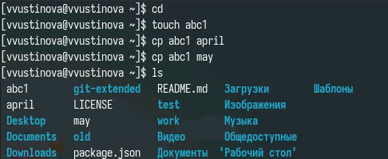{#fig:001 
width=70%}

## Копирование файлов и каталогов

Скопировать файлы april и may в каталог monthly и скопировать файл monthly/may в файл с именем june

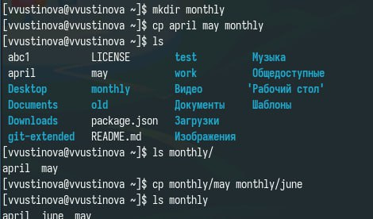{#fig:002 width=70%}

## Копирование файлов и каталогов

Скопировать каталог monthly в каталог
monthly.00 и Скопировать каталог monthly.00
в каталог /tmp

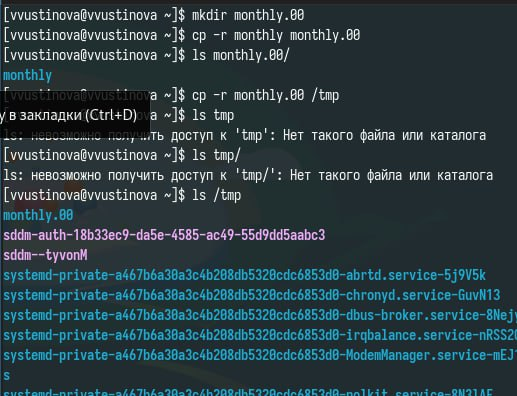{#fig:003 width=70%}

## Перемещение и переименование файлов и каталогов

Изменить название файла april на
july в домашнем каталоге и Переместить файл july в каталог monthly.00

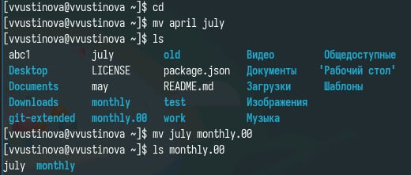{#fig:004 width=70%}

## Перемещение и переименование файлов и каталогов

Переименовать каталог monthly.00 в monthly.01

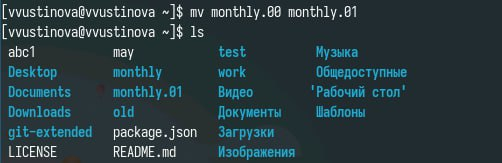{#fig:005 width=70%}

## Перемещение и переименование файлов и каталогов

Переместить каталог monthly.01в каталог reports и Переименовать каталог reports/monthly.01 в reports/monthly

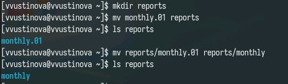{#fig:006 width=70%}

## Изменение прав доступа

Требуется создать файл ~/may с правом выполнения для владельца,Требуется лишить владельца файла ~/may права на выполнение

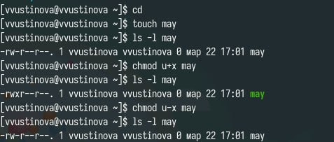{#fig:007 width=70%}

## Изменение прав доступа

Требуется создать каталог monthly с запретом на чтение для членов группы и всех остальных пользователей

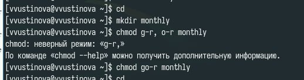{#fig:008 width=70%}

## Изменение прав доступа

Требуется создать файл ~/abc1 с правом записи для членов группы

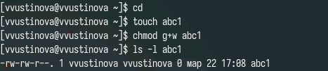{#fig:009 width=70%}

## Последовательность выполнения работы

Скопируйте файл /usr/include/sys/io.h в домашний каталог и назовите его equipment,в домашнем каталоге создайте директорию ~/ski.plases,переместите файл equipment в каталог ~/ski.plases

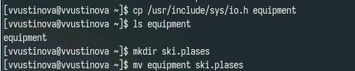{#fig:010 width=70%}

## Последовательность выполнения работы

Переименуйте файл ~/ski.plases/equipment в ~/ski.plases/equiplist.Создайте в домашнем каталоге файл abc1 и скопируйте его в каталог~/ski.plases, назовите его equiplist2

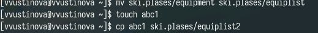{#fig:011 width=70%}

## Последовательность выполнения работы

Создайте каталог с именем equipment в каталоге ~/ski.plases.Переместите файлы ~/ski.plases/equiplist и equiplist2 в каталог~/ski.plases/equipment.Создайте и переместите каталог ~/newdir в каталог ~/ski.plases и назовите его plans

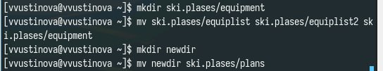{#fig:012 width=70%}

## Последовательность выполнения работы

Создайте нужные файлы и дайте им выделенные права доступа

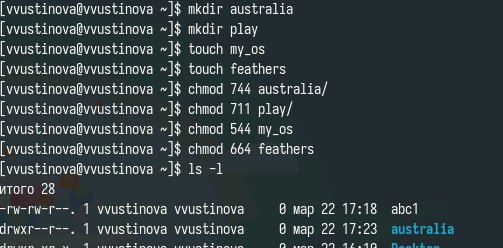{#fig:013 width=70%}

## Последовательность выполнения работы

Просмотрите содержимое файла /etc/password

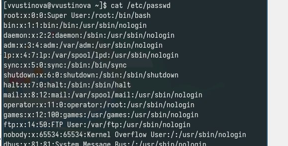{#fig:014 width=70%}

## Последовательность выполнения работы

Используя информацию, полученную при помощи команды Скопируйте файл ~/feathers в файл ~/file.old.Переместите файл ~/file.old в каталог ~/play.Скопируйте каталог ~/play в каталог ~/fun
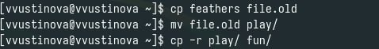{#fig:015 width=70%}

## Последовательность выполнения работы

Переместите каталог ~/fun в каталог ~/play и назовите его games.Лишите владельца файла ~/feathers права на чтение.Что произойдёт, если вы попытаетесь скопировать файл ~/feathers?

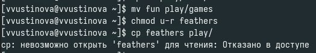{#fig:016 width=70%}

## Последовательность выполнения работы

Переместите каталог ~/fun в каталог ~/play и назовите его Дайте владельцу файла ~/feathers право на чтение.Лишите владельца каталога ~/play права на выполнение.Дайте владельцу каталога ~/play право на выполнение

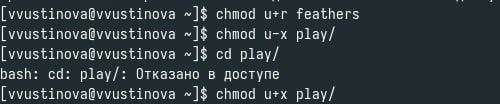{#fig:017 width=70%}

## Последовательность выполнения работы

Прочитайте man по командам mount, fsck, mkfs, kill

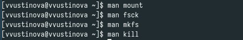{#fig:018 width=70%}

## Выводы

Мы успешно онакомились с файловой системой Linux, её структурой, именами и содержанием каталогов. Приобрели практические навыкы по применению команд для работы с файлами и каталогами, по управлению процессами (и работами), по проверке использования диска и обслуживанию файловой системы.

