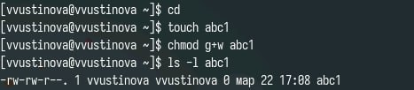

---
## Front matter
title: "Лабораторная работа №7"
subtitle: "Отчет"
author: "Устинова Виктория Вадимовна"

## Generic otions
lang: ru-RU
toc-title: "Содержание"

## Bibliography
bibliography: bib/cite.bib
csl: pandoc/csl/gost-r-7-0-5-2008-numeric.csl

## Pdf output format
toc: true # Table of contents
toc-depth: 2
lof: true # List of figures
lot: true # List of tables
fontsize: 12pt
linestretch: 1.5
papersize: a4
documentclass: scrreprt
## I18n polyglossia
polyglossia-lang:
  name: russian
  options:
	- spelling=modern
	- babelshorthands=true
polyglossia-otherlangs:
  name: english
## I18n babel
babel-lang: russian
babel-otherlangs: english
## Fonts
mainfont: IBM Plex Serif
romanfont: IBM Plex Serif
sansfont: IBM Plex Sans
monofont: IBM Plex Mono
mathfont: STIX Two Math
mainfontoptions: Ligatures=Common,Ligatures=TeX,Scale=0.94
romanfontoptions: Ligatures=Common,Ligatures=TeX,Scale=0.94
sansfontoptions: Ligatures=Common,Ligatures=TeX,Scale=MatchLowercase,Scale=0.94
monofontoptions: Scale=MatchLowercase,Scale=0.94,FakeStretch=0.9
mathfontoptions:
## Biblatex
biblatex: true
biblio-style: "gost-numeric"
biblatexoptions:
  - parentracker=true
  - backend=biber
  - hyperref=auto
  - language=auto
  - autolang=other*
  - citestyle=gost-numeric
## Pandoc-crossref LaTeX customization
figureTitle: "Рис."
tableTitle: "Таблица"
listingTitle: "Листинг"
lofTitle: "Список иллюстраций"
lotTitle: "Список таблиц"
lolTitle: "Листинги"
## Misc options
indent: true
header-includes:
  - \usepackage{indentfirst}
  - \usepackage{float} # keep figures where there are in the text
  - \floatplacement{figure}{H} # keep figures where there are in the text
---

# Цель работы

Онакомление с файловой системой Linux, её структурой, именами и содержанием каталогов. Приобретение практических навыков по применению команд для работы с файлами и каталогами, по управлению процессами (и работами), по проверке использования диска и обслуживанию файловой системы.

# Задание

Выполните все примеры, приведённые в первой части описания лабораторной работы.Выполните следующие действия, зафиксировав в отчёте по лабораторной работе
используемые при этом команды и результаты их выполнения.Определите опции команды chmod, необходимые для того, чтобы присвоить перечисПрочитайте man по командам mount, fsck, mkfs, kill и кратко их охарактеризуйте,
приведя примеры.ленным ниже файлам выделенные права доступа, считая, что в начале таких прав нет.Проделайте приведённые ниже упражнения, записывая в отчёт по лабораторной
работе используемые при этом команды

# Выполнение лабораторной работы

Копирование файла в текущем каталоге. Скопировать файл ~/abc1 в файл april и в файл may (рис. [-@fig:001]).

{#fig:001 width=70%}

Скопировать файлы april и may в каталог monthly и скопировать файл monthly/may в файл с именем june(рис. [-@fig:002]).

{#fig:002 width=70%}

Скопировать каталог monthly в каталог
monthly.00 и Скопировать каталог monthly.00
в каталог /tmp(рис. [-@fig:003]).

{#fig:003 width=70%}

Изменить название файла april на
july в домашнем каталоге и Переместить файл july в каталог monthly.00(рис. [-@fig:004]).

{#fig:004 width=70%}

Переименовать каталог monthly.00 в monthly.01(рис. [-@fig:005]).

{#fig:005 width=70%}

Переместить каталог monthly.01в каталог reports и Переименовать каталог reports/monthly.01 в reports/monthly(рис. [-@fig:006]).

{#fig:006 width=70%}

Требуется создать файл ~/may с правом выполнения для владельца,Требуется лишить владельца файла ~/may права на выполнение(рис. [-@fig:007]).

{#fig:007 width=70%}

Требуется создать каталог monthly с запретом на чтение для членов группы и всех остальных пользователей(рис. [-@fig:008]).

{#fig:008 width=70%}

Требуется создать файл ~/abc1 с правом записи для членов группы(рис. [-@fig:009]).

{#fig:009 width=70%}

Скопируйте файл /usr/include/sys/io.h в домашний каталог и назовите его equipment,в домашнем каталоге создайте директорию ~/ski.plases,переместите файл equipment в каталог ~/ski.plases.(рис. [-@fig:010]).

{#fig:010 width=70%}

Переименуйте файл ~/ski.plases/equipment в ~/ski.plases/equiplist.Создайте в домашнем каталоге файл abc1 и скопируйте его в каталог~/ski.plases, назовите его equiplist2.(рис. [-@fig:011]).

{#fig:011 width=70%}

Создайте каталог с именем equipment в каталоге ~/ski.plases.Переместите файлы ~/ski.plases/equiplist и equiplist2 в каталог~/ski.plases/equipment.Создайте и переместите каталог ~/newdir в каталог ~/ski.plases и назовите его plans.(рис. [-@fig:012]).

{#fig:012 width=70%}

Создайте нужные файлы и дайте им выделенные права доступа(рис. [-@fig:013]).

{#fig:013 width=70%}

Просмотрите содержимое файла /etc/password.(рис. [-@fig:014]).

{#fig:014 width=70%}

Используя информацию, полученную при помощи команды Скопируйте файл ~/feathers в файл ~/file.old.Переместите файл ~/file.old в каталог ~/play.Скопируйте каталог ~/play в каталог ~/fun(рис. [-@fig:015]).

{#fig:015 width=70%}

Переместите каталог ~/fun в каталог ~/play и назовите его games.Лишите владельца файла ~/feathers права на чтение.Что произойдёт, если вы попытаетесь скопировать файл ~/feathers?(рис. [-@fig:016]).

{#fig:016 width=70%}

Переместите каталог ~/fun в каталог ~/play и назовите его Дайте владельцу файла ~/feathers право на чтение.Лишите владельца каталога ~/play права на выполнение.Дайте владельцу каталога ~/play право на выполнение(рис. [-@fig:017]).

{#fig:017 width=70%}

Прочитайте man по командам mount, fsck, mkfs, kill (рис. [-@fig:018]).

{#fig:018 width=70%}

# Выводы

Мы успешно онакомились с файловой системой Linux, её структурой, именами и содержанием каталогов. Приобрели практические навыкы по применению команд для работы с файлами и каталогами, по управлению процессами (и работами), по проверке использования диска и обслуживанию файловой системы.

# Ответы на контрольные вопросы

1. Характеристики файловых систем (примеры): NTFS (Windows) - высокопроизводительная, journaling; ext4 (Linux) - робастная, journaling; FAT32 (старая, простая, без journaling).

2. Общая структура файловой системы: Корневой каталог (/ в Linux, C:\ в Windows) содержит директории первого уровня (например, Windows, Program Files, Users в Windows; /bin, /etc, /home, /tmp, /usr, /var в Linux). Каждая содержит подкаталоги и файлы.

3. Доступ ОС к ФС: Файловая система должна быть смонтирована (в Linux) или доступна через драйвер (в Windows).

4. Нарушение целостности ФС: Повреждение носителя, некорректное отключение, ошибки программного обеспечения. Устранение: проверка диска (chkdsk в Windows, fsck в Linux).

5. Создание ФС: С помощью утилиты форматирования (например, mkfs в Linux, format в Windows).

6. Просмотр текстовых файлов: cat, less, more (Linux), type, notepad (Windows).

7. cp (Linux): копирование файлов и каталогов.

8. mv (Linux): перемещение/переименование файлов и каталогов.

9. Права доступа: определяют, кто может читать, записывать и выполнять файлы/каталоги. Изменение: команда chmod (Linux), настройки безопасности (Windows).
