---
## Front matter
lang: ru-RU
title: Лабораторная работа №8
subtitle: Презентация
author:
 - Устинова В. В.
institute:
  - Российский университет дружбы народов, Москва, Россия
date: 29 марта 2025

## i18n babel
babel-lang: russian
babel-otherlangs: english

## Formatting pdf
toc: false
toc-title: Содержание
slide_level: 2
aspectratio: 169
section-titles: true
theme: metropolis
header-includes:
 - \metroset{progressbar=frametitle,sectionpage=progressbar,numbering=fraction}
---

# Информация

## Докладчик

:::::::::::::: {.columns align=center}
::: {.column width="70%"}

  * Устинова Виктория Вадимовна
  * студент НПИбд-01-24
  * Российский университет дружбы народов

:::
::: {.column width="30%"}

:::
::::::::::::::

## Цель работы

Ознакомление с инструментами поиска файлов и фильтрации текстовых данных.Приобретение практических навыков: по управлению процессами (и заданиями), по проверке использования диска и обслуживанию файловых систем.

## Задание

Выполните все примеры, приведённые в первой части описания лабораторной работы.Выполните следующие действия, зафиксировав в отчёте по лабораторной работе
используемые при этом команды и результаты их выполнения.

## Запишите название

Запишите в файл file.txt названия файлов, содержащихся в каталоге /etc

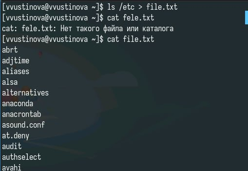{#fig:001 width=70%}

## Запишите название

Допишите в этот же файл названия файлов, содержащихся в вашем домашнем каталоге

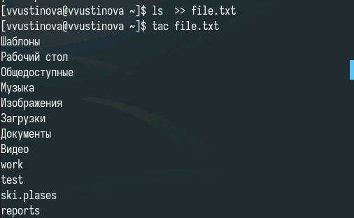{#fig:002 width=70%}

## Вывод

Выведите имена всех файлов из file.txt, имеющих расширение .conf

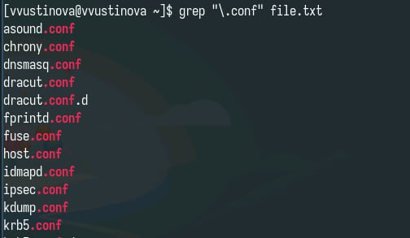{#fig:003 width=70%}

## Find

Запишите их в новый текстовой файл conf.txt и определите, какие файлы в вашем домашнем каталоге имеют имена, начинавшиеся с символа c

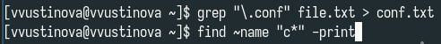{#fig:004 width=70%}

## Find

Определите, какие файлы в вашем домашнем каталоге имеют имена, начинавшиеся с символа c

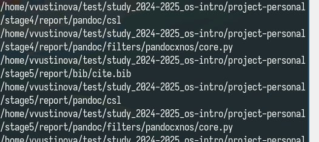{#fig:005 width=70%}

## Вариация

Предложите несколько вариантов, как это сделать

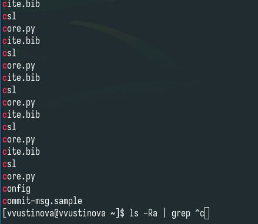{#fig:006 width=70%}

## Find

Запустите в фоновом режиме процесс, который будет записывать в файл ~/logfile файлы, имена которых начинаются с log

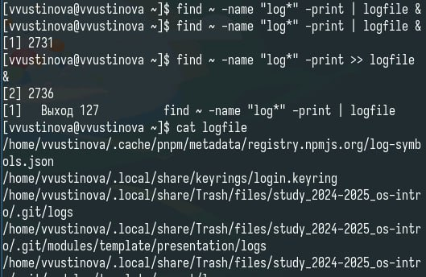{#fig:007 width=70%}

## Амперсанд

Удалите файл ~/logfile и запустите из консоли в фоновом режиме редактор gedit

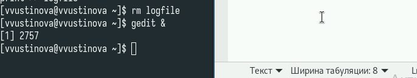{#fig:008 width=70%}

## Вариация

Определите идентификатор процесса gedit, используя команду ps, конвейер и фильтр grep. Как ещё можно определить идентификатор процесса?

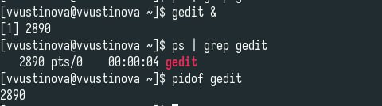{#fig:009 width=70%}

## Man

Прочтите справку (man) команды kill, после чего используйте её для завершения процесса gedit

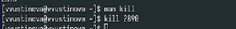{#fig:010 width=70%}

## Man 

Выполните команды df и du, предварительно получив более подробную информацию об этих командах, с помощью команды man

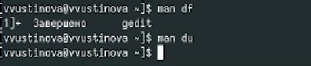{#fig:011 width=70%}

## Man find

Воспользовавшись справкой команды find, выведите имена всех директорий, имеющихся в вашем домашнем каталоге

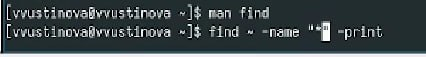{#fig:012 width=70%}

## Выводы

Мы успешно ознакомились с инструментами поиска файлов и фильтрации текстовых данных.Приобрели практические навыки: по управлению процессами (и заданиями), по проверке использования диска и обслуживанию файловых систем.

