---
## Front matter
title: "Лабораторная работа №8"
subtitle: "Отчет"
author: "Устинова Виктория Вадимовна"

## Generic otions
lang: ru-RU
toc-title: "Содержание"

## Bibliography
bibliography: bib/cite.bib
csl: pandoc/csl/gost-r-7-0-5-2008-numeric.csl

## Pdf output format
toc: true # Table of contents
toc-depth: 2
lof: true # List of figures
lot: true # List of tables
fontsize: 12pt
linestretch: 1.5
papersize: a4
documentclass: scrreprt
## I18n polyglossia
polyglossia-lang:
  name: russian
  options:
	- spelling=modern
	- babelshorthands=true
polyglossia-otherlangs:
  name: english
## I18n babel
babel-lang: russian
babel-otherlangs: english
## Fonts
mainfont: IBM Plex Serif
romanfont: IBM Plex Serif
sansfont: IBM Plex Sans
monofont: IBM Plex Mono
mathfont: STIX Two Math
mainfontoptions: Ligatures=Common,Ligatures=TeX,Scale=0.94
romanfontoptions: Ligatures=Common,Ligatures=TeX,Scale=0.94
sansfontoptions: Ligatures=Common,Ligatures=TeX,Scale=MatchLowercase,Scale=0.94
monofontoptions: Scale=MatchLowercase,Scale=0.94,FakeStretch=0.9
mathfontoptions:
## Biblatex
biblatex: true
biblio-style: "gost-numeric"
biblatexoptions:
  - parentracker=true
  - backend=biber
  - hyperref=auto
  - language=auto
  - autolang=other*
  - citestyle=gost-numeric
## Pandoc-crossref LaTeX customization
figureTitle: "Рис."
tableTitle: "Таблица"
listingTitle: "Листинг"
lofTitle: "Список иллюстраций"
lotTitle: "Список таблиц"
lolTitle: "Листинги"
## Misc options
indent: true
header-includes:
  - \usepackage{indentfirst}
  - \usepackage{float} # keep figures where there are in the text
  - \floatplacement{figure}{H} # keep figures where there are in the text
---

# Цель работы

Ознакомление с инструментами поиска файлов и фильтрации текстовых данных.Приобретение практических навыков: по управлению процессами (и заданиями), по проверке использования диска и обслуживанию файловых систем.

# Задание

Выполните все примеры, приведённые в первой части описания лабораторной работы.Выполните следующие действия, зафиксировав в отчёте по лабораторной работе
используемые при этом команды и результаты их выполнения.

# Выполнение лабораторной работы

Запишите в файл file.txt названия файлов, содержащихся в каталоге /etc.(рис. [-@fig:001]).

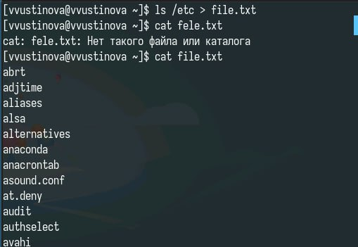{#fig:001 width=70%}

Допишите в этот же файл названия файлов, содержащихся в вашем домашнем каталоге(рис. [-@fig:002]).

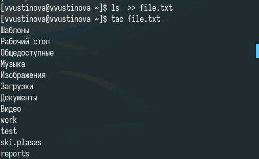{#fig:002 width=70%}

Выведите имена всех файлов из file.txt, имеющих расширение .conf(рис. [-@fig:003]).

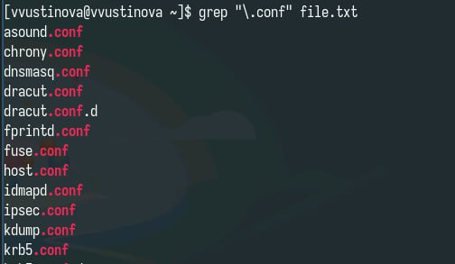{#fig:003 width=70%}

Запишите их в новый текстовой файл conf.txt и определите, какие файлы в вашем домашнем каталоге имеют имена, начинавшиеся с символа c(рис. [-@fig:004]).

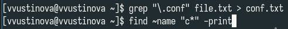{#fig:004 width=70%}

Определите, какие файлы в вашем домашнем каталоге имеют имена, начинавшиеся с символа c(рис. [-@fig:005]).

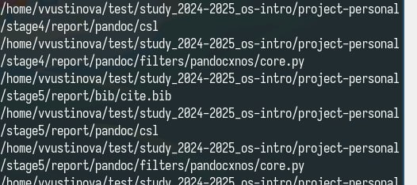{#fig:005 width=70%}

Предложите несколько вариантов, как это сделать(рис. [-@fig:006]).

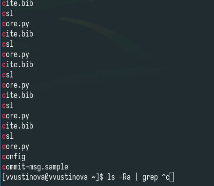{#fig:006 width=70%}

Запустите в фоновом режиме процесс, который будет записывать в файл ~/logfile файлы, имена которых начинаются с log(рис. [-@fig:007]).

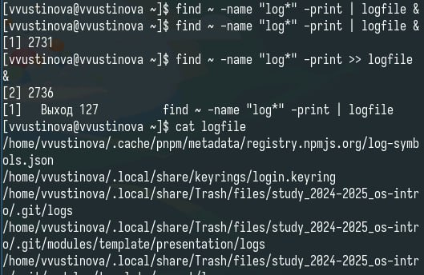{#fig:007 width=70%}

Удалите файл ~/logfile и запустите из консоли в фоновом режиме редактор gedit.(рис. [-@fig:008]).

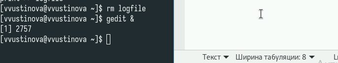{#fig:008 width=70%}

Определите идентификатор процесса gedit, используя команду ps, конвейер и фильтр grep. Как ещё можно определить идентификатор процесса?(рис. [-@fig:009]).

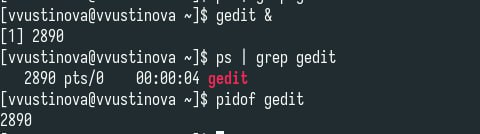{#fig:009 width=70%}

Прочтите справку (man) команды kill, после чего используйте её для завершения процесса gedit.(рис. [-@fig:010]).

{#fig:010 width=70%}(рис. [-@fig:010]).

Выполните команды df и du, предварительно получив более подробную информацию об этих командах, с помощью команды man(рис. [-@fig:011]).

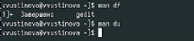{#fig:011 width=70%}

Воспользовавшись справкой команды find, выведите имена всех директорий, имеющихся в вашем домашнем каталоге(рис. [-@fig:012]).

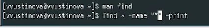{#fig:012 width=70%}

# Выводы

Мы успешно ознакомились с инструментами поиска файлов и фильтрации текстовых данных.Приобрели практические навыки: по управлению процессами (и заданиями), по проверке использования диска и обслуживанию файловых систем.

# Ответы на контрольные вопросы

1. Потоки ввода/вывода: Стандартный ввод (stdin), стандартный вывод (stdout), стандартный поток ошибок (stderr).

2. > и >>: > перенаправляет вывод, перезаписывая файл. >> перенаправляет вывод, добавляя его в конец файла.

3. Конвейер: Последовательность команд, где вывод одной команды становится вводом для следующей (соединяются символом |).

4. Процесс vs. Программа: Программа - это статический набор инструкций. Процесс - это экземпляр программы, находящийся в исполнении.

5. PID и GID: PID - идентификатор процесса. GID - идентификатор группы.

6. Задачи и управление: Задачи - процессы, выполняющиеся в фоновом режиме. Управляются командами jobs, bg, fg.

7. top и htop: top - мониторинг процессов в реальном времени (загрузка ЦП, памяти). htop - улучшенная интерактивная версия top.

8. Команда поиска файлов: find. Пример: find / -name "имя_файла". Ищет файлы в указанной директории по имени.

9. Поиск по контексту: Да, с помощью команды grep. Пример: grep "текст_для_поиска" файл.

10. Свободная память на диске: df -h.

11. Объем домашнего каталога: du -sh ~.

12. Удаление зависшего процесса: kill PID (отправка сигнала по умолчанию), kill -9 PID (принудительное завершение).

