---
## Front matter
lang: ru-RU
title: Лабораторная работа №9
subtitle: Презентация
author:
 - Устинова В. В.
institute:
  - Российский университет дружбы народов, Москва, Россия
date: 11 апреля 2025

## i18n babel
babel-lang: russian
babel-otherlangs: english

## Formatting pdf
toc: false
toc-title: Содержание
slide_level: 2
aspectratio: 169
section-titles: true
theme: metropolis
header-includes:
 - \metroset{progressbar=frametitle,sectionpage=progressbar,numbering=fraction}
---

# Информация

## Докладчик

:::::::::::::: {.columns align=center}
::: {.column width="70%"}

  * Устинова Виктория Вадимовна
  * студент НПИбд-01-24
  * Российский университет дружбы народов

:::
::: {.column width="30%"}

:::
::::::::::::::

## Цель работы

Освоение основных возможностей командной оболочки Midnight Commander. Приобретение навыков практической работы по просмотру каталогов и файлов; манипуляций с ними

## Задание

1. Изучите информацию о mc, вызвав в командной строке man mc.
2. Запустите из командной строки mc, изучите его структуру и меню.
. Выполните несколько операций в mc, используя управляющие клавиши (операции
с панелями; выделение/отмена выделения файлов, копирование/перемещение фай-
лов, получение информации о размере и правах доступа на файлы и/или каталоги
и т.п.)
4. Выполните основные команды меню левой (или правой) панели. Оцените степень
подробности вывода информации о файлах.
5. Используя возможности подменю Файл , выполните:
– просмотр содержимого текстового файла;
– редактирование содержимого текстового файла (без сохранения результатов
редактирования);
– создание каталога;
– копирование в файлов в созданный каталог.

## Задание

6. С помощью соответствующих средств подменю Команда осуществите:
– поиск в файловой системе файла с заданными условиями (например, файла
с расширением .c или .cpp, содержащего строку main);
– выбор и повторение одной из предыдущих команд;
– переход в домашний каталог;
– анализ файла меню и файла расширений.
7. Вызовите подменю Настройки . Освойте операции, определяющие структуру экрана mc
(Full screen, Double Width, Show Hidden Files и т.д.)

## mc

Изучите информацию о mc, вызвав в командной строке man mc.
и запустите из командной строки mc, изучите его структуру и меню

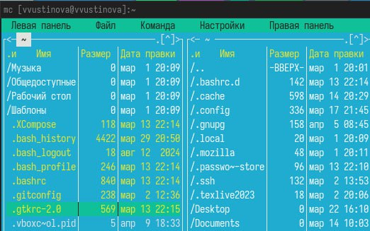{#fig:001 width=70%}

## Операции

Выполните несколько операций в mc, используя управляющие клавиши (операции с панелями; выделение/отмена выделения файлов, копирование/перемещение файлов, получение информации о размере и правах доступа на файлы и/или каталоги

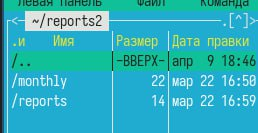{#fig:002 width=70%}

## Операции

Выполните основные команды меню левой (или правой) панели. Оцените степень подробности вывода информации о файлах

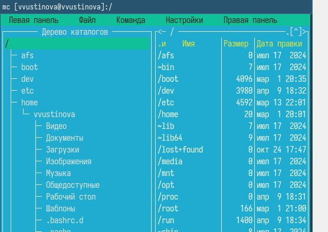{#fig:003 width=70%}

## Операции

Выполните основные команды меню левой (или правой) панели. Оцените степень подробности вывода информации о файлах

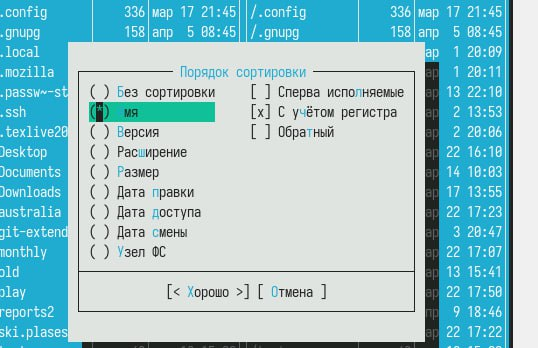{#fig:004 width=70%}

## Операции

Используя возможности подменю Файл , выполните:просмотр содержимого текстового файла;редактирование содержимого текстового файла, копирование в файлов в созданный каталог

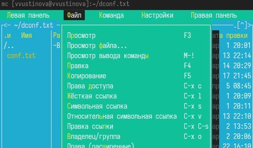{#fig:005 width=70%}

## Операции

Используя возможности подменю Файл выполните копирование в файлов в созданный каталог

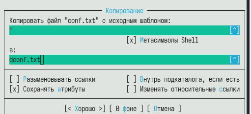{#fig:006 width=70%}

## Команда

С помощью соответствующих средств подменю Команда осуществите:поиск в файловой системе файла с заданными условиями

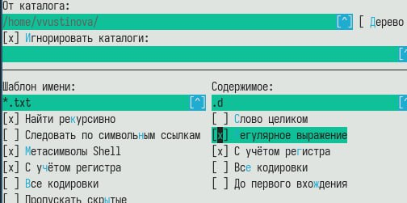{#fig:007 width=70%}

## Команда

С помощью соответствующих средств подменю Команда осуществите:поиск в файловой системе файла с заданными условиями

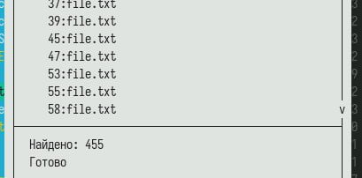{#fig:008 width=70%}

## Команда

С помощью соответствующих средств подменю Команда осуществите: выбор и повторение одной из предыдущих команд

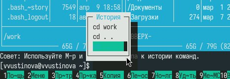{#fig:009 width=70%}

## Команда

С помощью соответствующих средств подменю Команда осуществите:  переход в домашний каталог

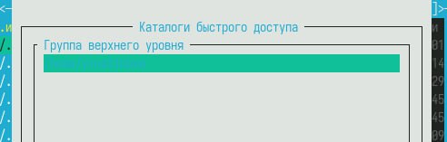{#fig:010 width=70%}

## Команда

С помощью соответствующих средств подменю Команда осуществите: анализ файла меню и файла расширений

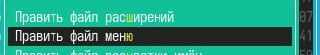{#fig:011 width=70%}

## Настройки

Вызовите подменю Настройки. Освойте операции, определяющие структуру экрана mc(Full screen, Double Width, Show Hidden Files и т.д.

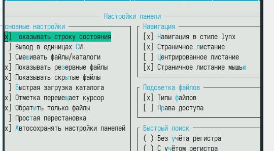{#fig:012 width=70%}

## Работа с файлом

Создайте текстовой файл text.txt.Откройте этот файл с помощью встроенного в mc редактора.Вставьте в открытый файл небольшой фрагмент текста, скопированный из любого другого файла или Интернета

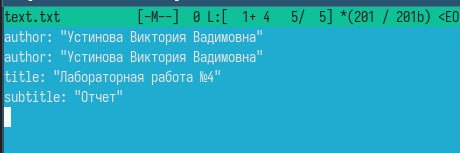{#fig:013 width=70%}

## Работа с файлом

Сохраните файл

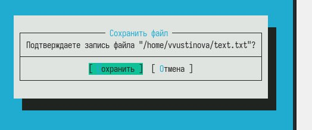{#fig:014 width=70%}

## Работа с файлами

Откройте файл с исходным текстом на некотором языке программирования

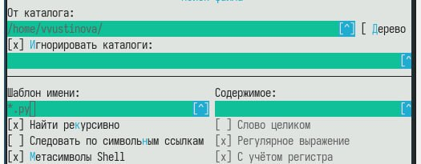{#fig:015 width=70%}

## Работа с файлами

Используя меню редактора, включите подсветку синтаксиса, если она не включена, или выключите, если она включена.

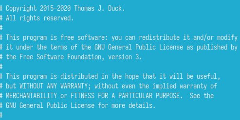{#fig:016 width=70%}

## Работа с файлами

Используя меню редактора, включите подсветку синтаксиса, если она не включена, или выключите, если она включена.

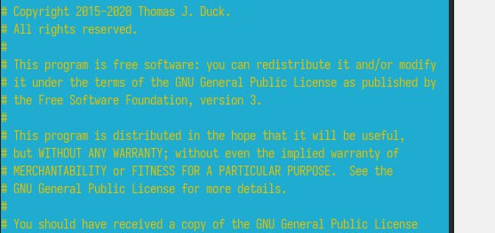{#fig:017 width=70%}

## Выводы

Мы успешно оосвоили основные возможности командной оболочки Midnight Commander. Приобрели навыкы практической работы по просмотру каталогов и файлов; манипуляций с ними.
