---
## Front matter
title: "Лабораторная работа №8"
subtitle: "Отчет"
author: "Устинова Виктория Вадимовна"

## Generic otions
lang: ru-RU
toc-title: "Содержание"

## Bibliography
bibliography: bib/cite.bib
csl: pandoc/csl/gost-r-7-0-5-2008-numeric.csl

## Pdf output format
toc: true # Table of contents
toc-depth: 2
lof: true # List of figures
lot: true # List of tables
fontsize: 12pt
linestretch: 1.5
papersize: a4
documentclass: scrreprt
## I18n polyglossia
polyglossia-lang:
  name: russian
  options:
	- spelling=modern
	- babelshorthands=true
polyglossia-otherlangs:
  name: english
## I18n babel
babel-lang: russian
babel-otherlangs: english
## Fonts
mainfont: IBM Plex Serif
romanfont: IBM Plex Serif
sansfont: IBM Plex Sans
monofont: IBM Plex Mono
mathfont: STIX Two Math
mainfontoptions: Ligatures=Common,Ligatures=TeX,Scale=0.94
romanfontoptions: Ligatures=Common,Ligatures=TeX,Scale=0.94
sansfontoptions: Ligatures=Common,Ligatures=TeX,Scale=MatchLowercase,Scale=0.94
monofontoptions: Scale=MatchLowercase,Scale=0.94,FakeStretch=0.9
mathfontoptions:
## Biblatex
biblatex: true
biblio-style: "gost-numeric"
biblatexoptions:
  - parentracker=true
  - backend=biber
  - hyperref=auto
  - language=auto
  - autolang=other*
  - citestyle=gost-numeric
## Pandoc-crossref LaTeX customization
figureTitle: "Рис."
tableTitle: "Таблица"
listingTitle: "Листинг"
lofTitle: "Список иллюстраций"
lotTitle: "Список таблиц"
lolTitle: "Листинги"
## Misc options
indent: true
header-includes:
  - \usepackage{indentfirst}
  - \usepackage{float} # keep figures where there are in the text
  - \floatplacement{figure}{H} # keep figures where there are in the text
---

# Цель работы

Освоение основных возможностей командной оболочки Midnight Commander. Приобретение навыков практической работы по просмотру каталогов и файлов; манипуляций с ними

# Задание

1. Изучите информацию о mc, вызвав в командной строке man mc.
2. Запустите из командной строки mc, изучите его структуру и меню.
. Выполните несколько операций в mc, используя управляющие клавиши (операции
с панелями; выделение/отмена выделения файлов, копирование/перемещение фай-
лов, получение информации о размере и правах доступа на файлы и/или каталоги
и т.п.)
4. Выполните основные команды меню левой (или правой) панели. Оцените степень
подробности вывода информации о файлах.
5. Используя возможности подменю Файл , выполните:
– просмотр содержимого текстового файла;
– редактирование содержимого текстового файла (без сохранения результатов
редактирования);
– создание каталога;
– копирование в файлов в созданный каталог.
6. С помощью соответствующих средств подменю Команда осуществите:
– поиск в файловой системе файла с заданными условиями (например, файла
с расширением .c или .cpp, содержащего строку main);
– выбор и повторение одной из предыдущих команд;
– переход в домашний каталог;
– анализ файла меню и файла расширений.
7. Вызовите подменю Настройки . Освойте операции, определяющие структуру экрана mc
(Full screen, Double Width, Show Hidden Files и т.д.)

# Выполнение лабораторной работы

Изучите информацию о mc, вызвав в командной строке man mc.
и запустите из командной строки mc, изучите его структуру и меню(рис. [-@fig:001]).

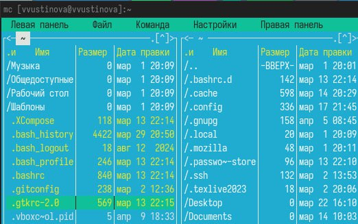{#fig:001 width=70%}

Выполните несколько операций в mc, используя управляющие клавиши (операции с панелями; выделение/отмена выделения файлов, копирование/перемещение файлов, получение информации о размере и правах доступа на файлы и/или каталоги(рис. [-@fig:002]).

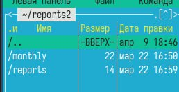{#fig:002 width=70%}

Выполните основные команды меню левой (или правой) панели. Оцените степень подробности вывода информации о файлах.(рис. [-@fig:003]).

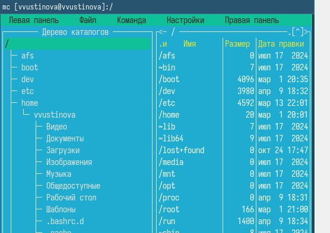{#fig:003 width=70%}

Выполните основные команды меню левой (или правой) панели. Оцените степень подробности вывода информации о файлах.(рис. [-@fig:004]).

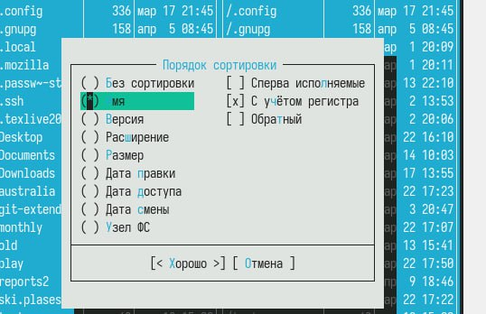{#fig:004 width=70%}

Используя возможности подменю Файл , выполните:просмотр содержимого текстового файла;редактирование содержимого текстового файла (без сохранения результатов
редактирования), копирование в файлов в созданный каталог.(рис. [-@fig:005]).

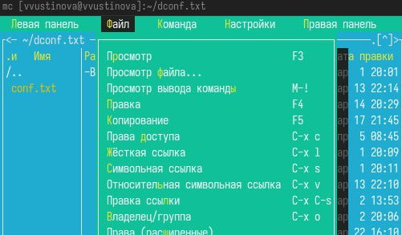{#fig:005 width=70%}

Используя возможности подменю Файл выполните копирование в файлов в созданный каталог(рис. [-@fig:006]).

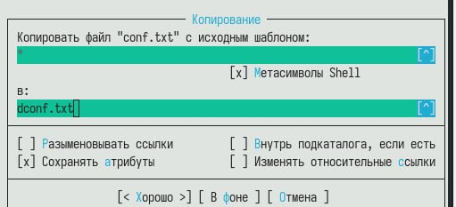{#fig:006 width=70%}

С помощью соответствующих средств подменю Команда осуществите:поиск в файловой системе файла с заданными условиями(рис. [-@fig:007]).

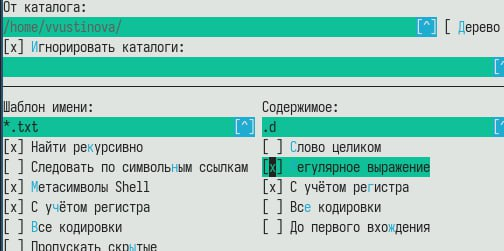{#fig:007 width=70%}

С помощью соответствующих средств подменю Команда осуществите:поиск в файловой системе файла с заданными условиями(рис. [-@fig:008]).

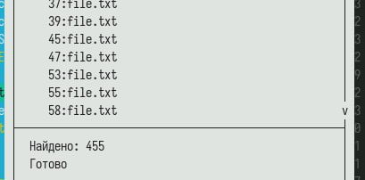{#fig:008 width=70%}

С помощью соответствующих средств подменю Команда осуществите: выбор и повторение одной из предыдущих команд(рис. [-@fig:009]).

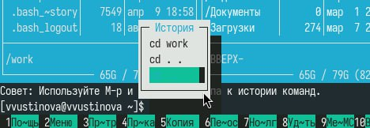{#fig:009 width=70%}

С помощью соответствующих средств подменю Команда осуществите:  переход в домашний каталог(рис. [-@fig:010]).

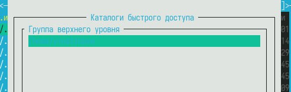{#fig:010 width=70%}

С помощью соответствующих средств подменю Команда осуществите: анализ файла меню и файла расширений(рис. [-@fig:011]).

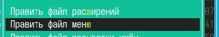{#fig:011 width=70%}

 Вызовите подменю Настройки. Освойте операции, определяющие структуру экрана mc(Full screen, Double Width, Show Hidden Files и т.д.(рис. [-@fig:012]).

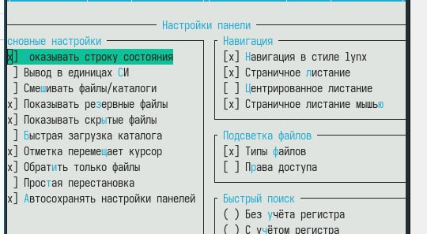{#fig:012 width=70%}

Создайте текстовой файл text.txt.Откройте этот файл с помощью встроенного в mc редактора.Вставьте в открытый файл небольшой фрагмент текста, скопированный из любого другого файла или Интернета(рис. [-@fig:013]).

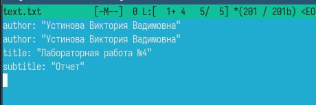{#fig:013 width=70%}

Сохраните файл(рис. [-@fig:014]).

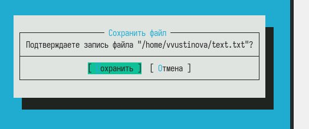{#fig:014 width=70%}

Откройте файл с исходным текстом на некотором языке программирования(рис. [-@fig:015]).

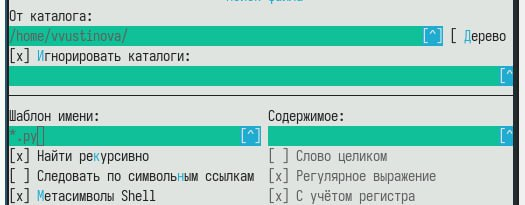{#fig:015 width=70%}

Используя меню редактора, включите подсветку синтаксиса, если она не включена, или выключите, если она включена.(рис. [-@fig:016]).

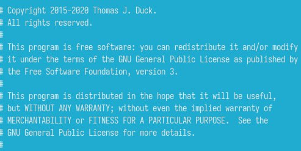{#fig:016 width=70%}

Используя меню редактора, включите подсветку синтаксиса, если она не включена, или выключите, если она включена.(рис. [-@fig:017]).

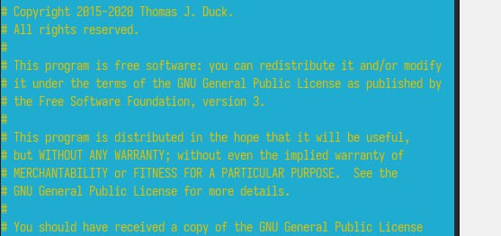{#fig:017 width=70%}

# Выводы

Мы успешно оосвоили основные возможности командной оболочки Midnight Commander. Приобрели навыкы практической работы по просмотру каталогов и файлов; манипуляций с ними.

# Ответы на контрольные вопросы

1. Режимы работы mc:
  •  Двухпанельный режим: Стандартный режим, с двумя панелями для навигации и работы с файлами.
  •  Однопанельный режим: Используется одна панель, вторая может быть скрыта. Часто полезен для работы в терминале с небольшим размером экрана.
  •  Режим просмотра/редактирования: Открывает файл для просмотра или редактирования во встроенном редакторе/вьювере.
  •  Командная строка: Позволяет выполнять команды shell, вводить их вручную в нижней части экрана.

2. Операции с файлами (Shell и MC):
  •  Копирование: Shell: cp file1 file2. MC: F5.
  •  Перемещение/Переименование: Shell: mv file1 file2. MC: F6.
  •  Создание каталога: Shell: mkdir directory. MC: F7.
  •  Удаление: Shell: rm file. MC: F8.
  •  Создание символической ссылки: Shell: ln -s target link. MC: Alt+L.

3. Меню левой/правой панели:
  •  Содержит команды для навигации (смена каталога), выбора режима отображения (краткий, подробный, пользовательский), сортировки файлов, поиска, создания каталогов, быстрого просмотра и выполнения команд над файлами/каталогами.

4. Меню "Файл":
  •  Содержит команды для работы с текущим файлом/каталогом: просмотр, редактирование, копирование, перемещение, создание каталога, создание ссылки, смена прав доступа (chmod), смена владельца (chown), удаление, выход.

5. Меню "Команда":
  •  Содержит более сложные команды: просмотр дерева каталогов, сравнение каталогов, поиск файлов, изменение прав доступа для группы файлов, переименование группы файлов, создание архивов, распаковка архивов, запуск внешних команд, панель быстрого запуска.

6. Меню "Настройки":
  •  Содержит параметры для настройки внешнего вида и поведения mc: конфигурация дисплея, клавиатуры, мыши, виртуальных файловых систем, отображения файлов, записи логов, редактора, скорости обновления экрана.

7. Встроенные команды mc:
  •  cd: Смена текущего каталога.
  •  ! command: Выполнение внешней shell-команды.
  •  pwd: Вывод текущего каталога.
  •  mc: Запуск нового экземпляра mc.

8. Команды встроенного редактора mc:
  •  F3: Просмотр файла.
  •  F4: Редактирование файла.
  •  F2: Сохранение файла.
  •  Ctrl+S: Сохранение файла.
  •  Ctrl+Q: Выход из редактора без сохранения.
  •  Поиск/Замена: Ctrl+F/Ctrl+A.
  •  Копирование/Вставка: Ctrl+Ins/Shift+Ins.

9. Меню, определяемые пользователем:
  •  mc позволяет создавать пользовательские меню (User Menu), определяемые в файле .mc/menu. Эти меню могут содержать команды для работы с определенными типами файлов или выполнения специфических задач.

10. Действия, определяемые пользователем, над текущим файлом:
  •  Через User Menu можно определять команды, которые будут выполняться над текущим выделенным файлом. Например, можно создать команду для запуска специфического компилятора для файлов определенного типа, или для конвертации изображений. В команде можно использовать подстановки, такие как %f (имя текущего файла).

