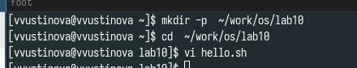
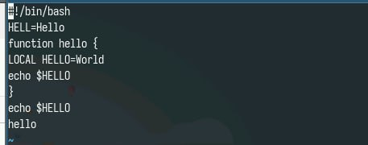
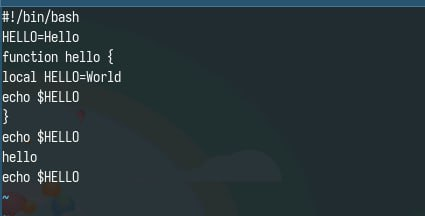
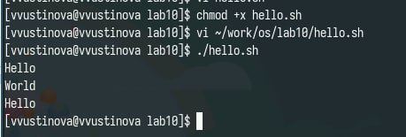

---
## Front matter
lang: ru-RU
title: Лабораторная работа №10
subtitle: Презентация
author:
 - Устинова В. В.
institute:
  - Российский университет дружбы народов, Москва, Россия
date: 12 апреля 2025

## i18n babel
babel-lang: russian
babel-otherlangs: english

## Formatting pdf
toc: false
toc-title: Содержание
slide_level: 2
aspectratio: 169
section-titles: true
theme: metropolis
header-includes:
 - \metroset{progressbar=frametitle,sectionpage=progressbar,numbering=fraction}
---

# Информация

## Докладчик

:::::::::::::: {.columns align=center}
::: {.column width="70%"}

  * Устинова Виктория Вадимовна
  * студент НПИбд-01-24
  * Российский университет дружбы народов
:::
::: {.column width="30%"}

:::
::::::::::::::

## Цель работы

Познакомиться с операционной системой Linux. Получить практические навыки работы с редактором vi, установленным по умолчанию практически во всех дистрибутивах

## Задание

Задание 1. Создание нового файла с использованием vi
Задание 2. Редактирование существующего файла

## Создание нового файла с использованием vi

Создаем каталог и переходим туда

{#fig:001 width=70%}

## Создание нового файла с использованием vi

Нажмите клавишу i и вводите следующий текст:

{#fig:002 width=70%}

## Редактирование существующего файла

Перейдите в режим вставки и замените на HELLO, замените LOCAL на local и добавьте в конец echo $HELLO

{#fig:003 width=70%}

## Редактирование существующего файла

Делаем файл исполняемым и пробуем запустить

{#fig:004 width=70%}

## Выводы

Мы успешно познакомились с операционной системой Linux. Получили практические навыки работы с редактором vi, установленным по умолчанию практически во всех дистрибутивах
