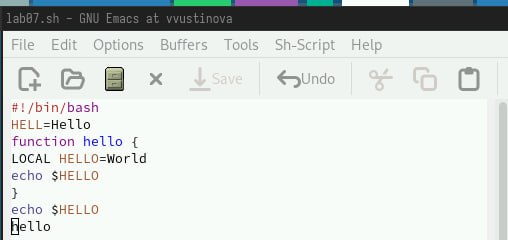
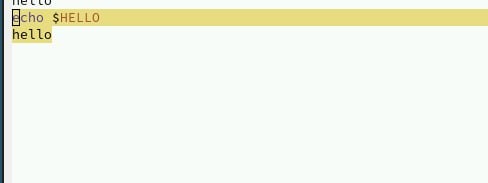
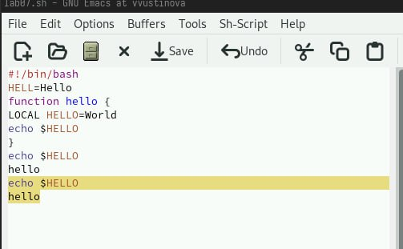
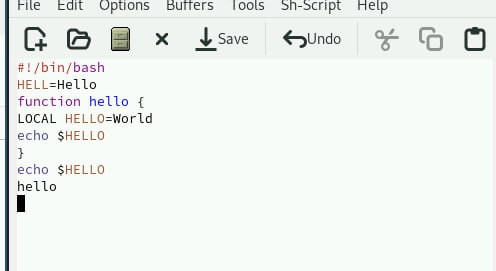
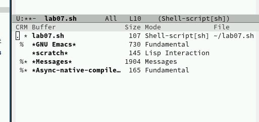
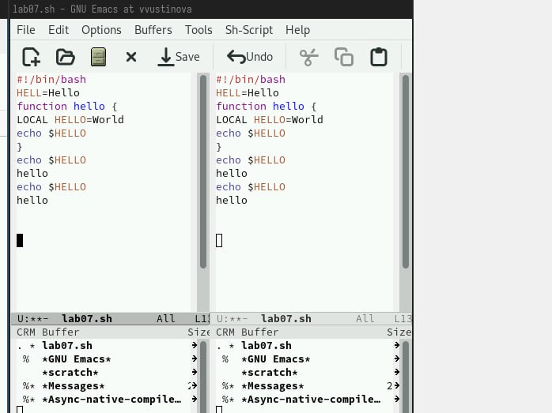
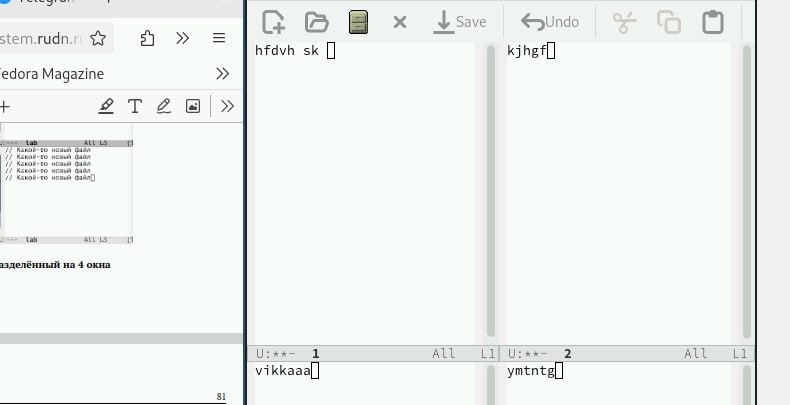
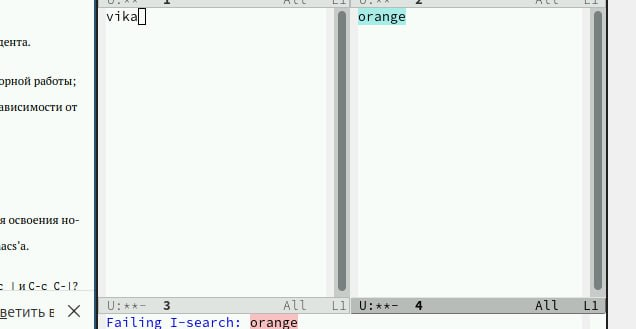

---
## Front matter
lang: ru-RU
title: Лабораторная работа №11
subtitle: Презентация
author:
 - Устинова В. В.
institute:
  - Российский университет дружбы народов, Москва, Россия
date: 24 апреля 2025

## i18n babel
babel-lang: russian
babel-otherlangs: english

## Formatting pdf
toc: false
toc-title: Содержание
slide_level: 2
aspectratio: 169
section-titles: true
theme: metropolis
header-includes:
 - \metroset{progressbar=frametitle,sectionpage=progressbar,numbering=fraction}
---

# Информация

## Докладчик

:::::::::::::: {.columns align=center}
::: {.column width="70%"}

  * Устинова Виктория Вадимовна
  * студент НПИбд-01-24
  * Российский университет дружбы народов

:::
::: {.column width="30%"}

:::
::::::::::::::

## Цель работы

Познакомиться с операционной системой Linux. Получить практические навыки работы с редактором Emacs.

## Задание

1. Ознакомиться с теоретическим материалом.
2. Ознакомиться с редактором emacs.
3. Выполнить упражнения.
4. Ответить на контрольные вопросы.

## Работа с текстом

Создать файл lab07.sh с помощью комбинации Ctrl-x Ctrl-f (C-x C-f).Наберите текст:

{#fig:001 width=70%}

## Работа с текстом

Выделить область текста (C-space)

{#fig:002 width=70%}

## Работа с текстом

Скопировать область в буфер обмена (M-w).Вставить область в конец файла

{#fig:003 width=70%}

## Работа с текстом

Вновь выделить эту область и на этот раз вырезать её (C-w)

{#fig:004 width=70%}

## Управление буферами

 Вывести список активных буферов на экран (C-x C-b)

{#fig:005 width=70%}

## Управление окнами

Поделите фрейм на 4 части: разделите фрейм на два окна по вертикали (C-x 3), а затем каждое из этих окон на две части по горизонтали (C-x 2)

{#fig:006 width=70%}

## Управление окнами

В каждом из четырёх созданных окон откройте новый буфер (файл) и введите несколько строк текста

{#fig:007 width=70%}

## Режим поиска

Переключитесь в режим поиска (C-s) и найдите несколько слов, присутствующих в тексте

{#fig:008 width=70%}

## Выводы

Мы успешно познакомились с операционной системой Linux. Получили практические навыки работы с редактором Emacs.

