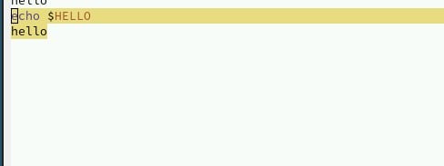
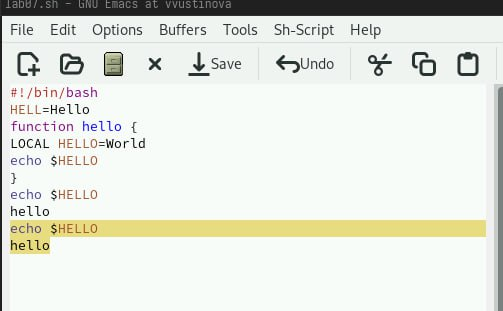
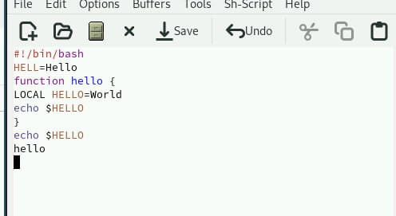
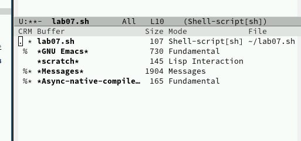
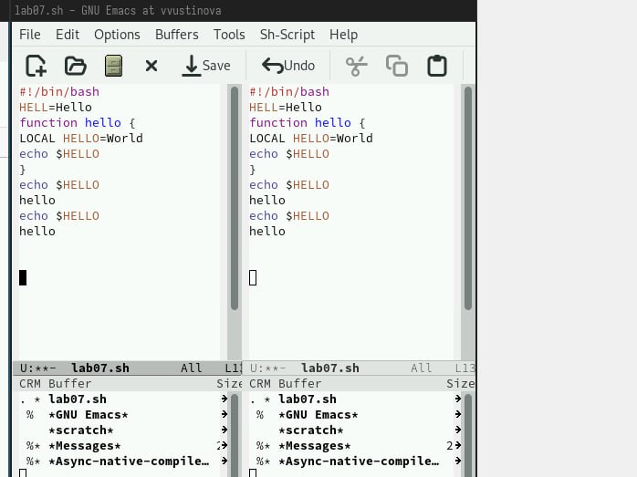
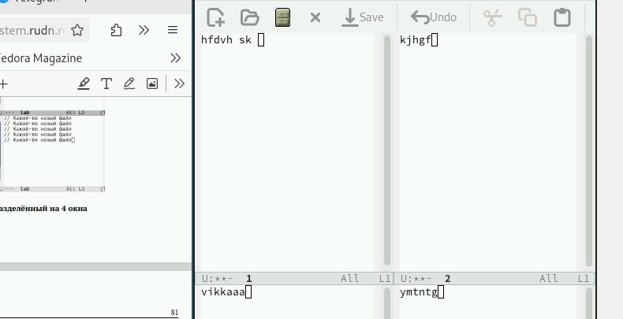
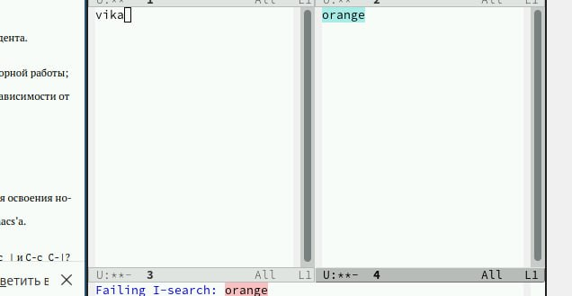

---
## Front matter
title: "Лабораторная работа №11"
subtitle: "Отчет"
author: "Устинова Виктория Вадимовна"

## Generic otions
lang: ru-RU
toc-title: "Содержание"

## Bibliography
bibliography: bib/cite.bib
csl: pandoc/csl/gost-r-7-0-5-2008-numeric.csl

## Pdf output format
toc: true # Table of contents
toc-depth: 2
lof: true # List of figures
lot: true # List of tables
fontsize: 12pt
linestretch: 1.5
papersize: a4
documentclass: scrreprt
## I18n polyglossia
polyglossia-lang:
  name: russian
  options:
	- spelling=modern
	- babelshorthands=true
polyglossia-otherlangs:
  name: english
## I18n babel
babel-lang: russian
babel-otherlangs: english
## Fonts
mainfont: IBM Plex Serif
romanfont: IBM Plex Serif
sansfont: IBM Plex Sans
monofont: IBM Plex Mono
mathfont: STIX Two Math
mainfontoptions: Ligatures=Common,Ligatures=TeX,Scale=0.94
romanfontoptions: Ligatures=Common,Ligatures=TeX,Scale=0.94
sansfontoptions: Ligatures=Common,Ligatures=TeX,Scale=MatchLowercase,Scale=0.94
monofontoptions: Scale=MatchLowercase,Scale=0.94,FakeStretch=0.9
mathfontoptions:
## Biblatex
biblatex: true
biblio-style: "gost-numeric"
biblatexoptions:
  - parentracker=true
  - backend=biber
  - hyperref=auto
  - language=auto
  - autolang=other*
  - citestyle=gost-numeric
## Pandoc-crossref LaTeX customization
figureTitle: "Рис."
tableTitle: "Таблица"
listingTitle: "Листинг"
lofTitle: "Список иллюстраций"
lotTitle: "Список таблиц"
lolTitle: "Листинги"
## Misc options
indent: true
header-includes:
  - \usepackage{indentfirst}
  - \usepackage{float} # keep figures where there are in the text
  - \floatplacement{figure}{H} # keep figures where there are in the text
---

# Цель работы

Познакомиться с операционной системой Linux. Получить практические навыки работы с редактором Emacs.

# Задание

1. Ознакомиться с теоретическим материалом.
2. Ознакомиться с редактором emacs.
3. Выполнить упражнения.
4. Ответить на контрольные вопросы.

# Выполнение лабораторной работы

Создать файл lab07.sh с помощью комбинации Ctrl-x Ctrl-f (C-x C-f).Наберите текст:(рис. [-@fig:001]).

{#fig:001 width=70%}

Выделить область текста (C-space)(рис. [-@fig:002]).

{#fig:002 width=70%}

Скопировать область в буфер обмена (M-w).Вставить область в конец файла(рис. [-@fig:003]).

{#fig:003 width=70%}

Вновь выделить эту область и на этот раз вырезать её (C-w)(рис. [-@fig:004]).

{#fig:004 width=70%}

 Вывести список активных буферов на экран (C-x C-b)(рис. [-@fig:005]).

{#fig:005 width=70%}

Поделите фрейм на 4 части: разделите фрейм на два окна по вертикали (C-x 3), а затем каждое из этих окон на две части по горизонтали (C-x 2)(рис. [-@fig:006]).

{#fig:006 width=70%}

В каждом из четырёх созданных окон откройте новый буфер (файл) и введите несколько строк текста.(рис. [-@fig:007]).

{#fig:007 width=70%}

Переключитесь в режим поиска (C-s) и найдите несколько слов, присутствующих в тексте(рис. [-@fig:008]).

{#fig:008 width=70%}

# Выводы

Мы успешно познакомились с операционной системой Linux. Получили практические навыки работы с редактором Emacs.

# Ответы на контрольные вопросы

1. Emacs: Расширяемый текстовый редактор, настраиваемый и самодокументируемый.

2. Сложность для новичка: Непривычные сочетания клавиш, мощный, но сложный язык Lisp для конфигурации.

3. Буфер: Область памяти, содержащая текст (или другой контент). Окно: Визуальная область на экране, отображающая буфер.

4. Больше 10 буферов в одном окне? Нет, окно показывает только один буфер. Можно иметь несколько буферов, отображаемых в разных окнах.

5. Буферы по умолчанию: \scratch\, \Messages\.

6. Клавиши для C-c | и C-c C-|: C-c | - Ctrl-c |, C-c C-| - Ctrl-c Ctrl-|.

7. Разделить окно: C-x 2 (горизонтально), C-x 3 (вертикально).

8. Файл настроек: ~/.emacs.d/init.el или ~/.emacs.

9. Клавиша: Выполняет назначенную ей команду. Да, клавиши можно переназначить.

10. Удобство (субъективно): Зависит от предпочтений. (Без конкретного опыта с vi не могу ответить)
