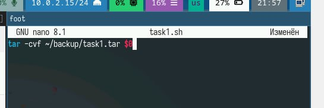
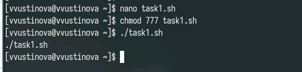
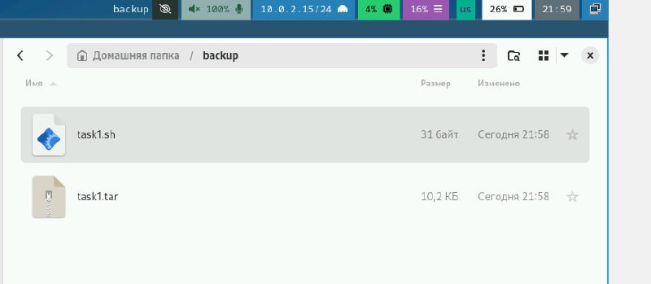
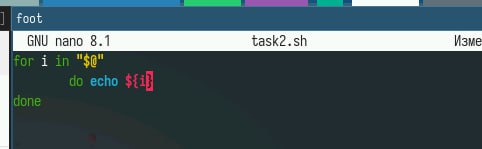
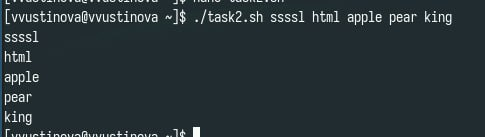
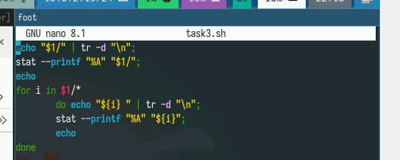
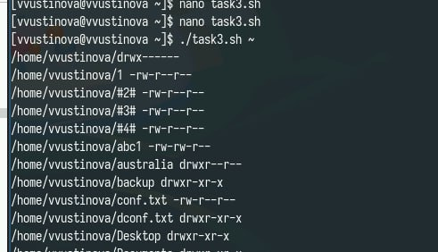
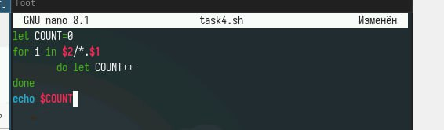
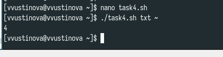

---
## Front matter
lang: ru-RU
title: Лабораторная работа №12
subtitle: Презентация
author:
 - Устинова В. В.
institute:
  - Российский университет дружбы народов, Москва, Россия
date: 27 апреля 2025

## i18n babel
babel-lang: russian
babel-otherlangs: english

## Formatting pdf
toc: false
toc-title: Содержание
slide_level: 2
aspectratio: 169
section-titles: true
theme: metropolis
header-includes:
 - \metroset{progressbar=frametitle,sectionpage=progressbar,numbering=fraction}
---

# Информация

## Докладчик

:::::::::::::: {.columns align=center}
::: {.column width="70%"}

  * Устинова Виктория Вадимовна
  * студент НПИбд-01-24
  * Российский университет дружбы народов

:::
::: {.column width="30%"}

:::
::::::::::::::

## Цель работы

Изучить основы программирования в оболочке ОС UNIX/Linux. Научиться писать небольшие командные файлы.

## Задание

1. Написать скрипт, который при запуске будет делать резервную копию самого себя (то
есть файла, в котором содержится его исходный код) в другую директорию backup
в вашем домашнем каталоге. При этом файл должен архивироваться одним из ар-
хиваторов на выбор zip, bzip2 или tar. Способ использования команд архивации
необходимо узнать, изучив справку.
2. Написать пример командного файла, обрабатывающего любое произвольное число
аргументов командной строки, в том числе превышающее десять. Например, скрипт
может последовательно распечатывать значения всех переданных аргументов.
3. Написать командный файл — аналог команды ls (без использования самой этой ко-
манды и команды dir). Требуется, чтобы он выдавал информацию о нужном каталоге
и выводил информацию о возможностях доступа к файлам этого каталога.
4. Написать командный файл, который получает в качестве аргумента командной строки
формат файла (.txt, .doc, .jpg, .pdf и т.д.) и вычисляет количество таких файлов
в указанной директории. Путь к директории также передаётся в виде аргумента ко-
мандной строки.

## Резервная копия

Написать скрипт, который будет делать резервную копию самого себя

{#fig:001 width=70%}

## Резервная копия

Запускаем файл

{#fig:002 width=70%}

## Резервная копия

При этом файл должен архивироваться одним из архиваторов на выбор

{#fig:003 width=70%}

## Вывод последовательно

Создаем новый файл для второго задания и открываем редактор

{#fig:004 width=70%}

## Вывод последовательно

Написать пример командного файла, обрабатывающего любое произвольное число аргументов командной строки

{#fig:005 width=70%}

## Вывод последовательно

Скрипт может последовательно распечатывать значения всех переданных аргументов

{#fig:006 width=70%}

## Аналог команды ls

Написать командный файл — аналог команды ls (без использования самой этой команды и команды dir)

{#fig:007 width=70%}

## Аналог команды ls

Требуется, чтобы он выдавал информацию о нужном каталоге
и выводил информацию о возможностях доступа к файлам этого каталога

{#fig:008 width=70%}

## Кол-во txt

Написать командный файл, который получает в качестве аргумента командной строки формат файла (.txt, .doc, .jpg, .pdf и т.д.) и вычисляет количество таких файлов в указанной директории. 

{#fig:009 width=70%}

## Кол-во txt

Проверяем выполнение

{#fig:010 width=70%}

## Выводы

Мы успешно изучили основы программирования в оболочке ОС UNIX/Linux. Научились писать небольшие командные файлы.
