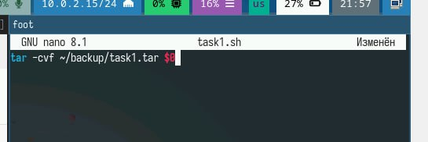
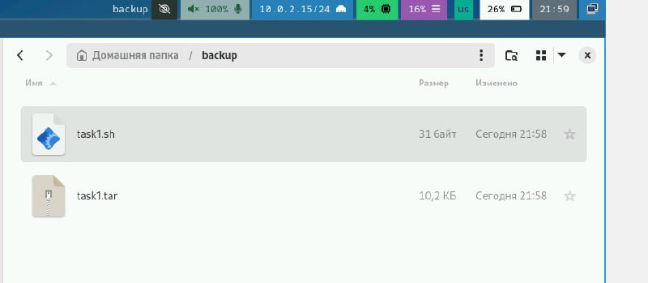
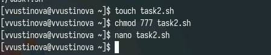
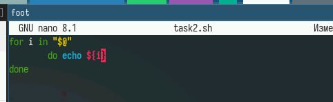
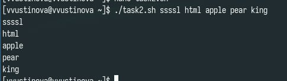
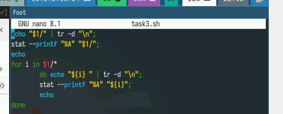
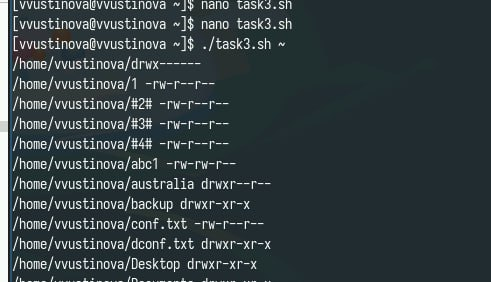
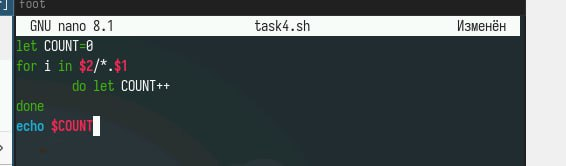
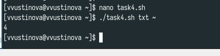

---
## Front matter
title: "Лабораторная работа №12"
subtitle: "Отчет"
author: "Устинова Виктория Вадимовна"

## Generic otions
lang: ru-RU
toc-title: "Содержание"

## Bibliography
bibliography: bib/cite.bib
csl: pandoc/csl/gost-r-7-0-5-2008-numeric.csl

## Pdf output format
toc: true # Table of contents
toc-depth: 2
lof: true # List of figures
lot: true # List of tables
fontsize: 12pt
linestretch: 1.5
papersize: a4
documentclass: scrreprt
## I18n polyglossia
polyglossia-lang:
  name: russian
  options:
	- spelling=modern
	- babelshorthands=true
polyglossia-otherlangs:
  name: english
## I18n babel
babel-lang: russian
babel-otherlangs: english
## Fonts
mainfont: IBM Plex Serif
romanfont: IBM Plex Serif
sansfont: IBM Plex Sans
monofont: IBM Plex Mono
mathfont: STIX Two Math
mainfontoptions: Ligatures=Common,Ligatures=TeX,Scale=0.94
romanfontoptions: Ligatures=Common,Ligatures=TeX,Scale=0.94
sansfontoptions: Ligatures=Common,Ligatures=TeX,Scale=MatchLowercase,Scale=0.94
monofontoptions: Scale=MatchLowercase,Scale=0.94,FakeStretch=0.9
mathfontoptions:
## Biblatex
biblatex: true
biblio-style: "gost-numeric"
biblatexoptions:
  - parentracker=true
  - backend=biber
  - hyperref=auto
  - language=auto
  - autolang=other*
  - citestyle=gost-numeric
## Pandoc-crossref LaTeX customization
figureTitle: "Рис."
tableTitle: "Таблица"
listingTitle: "Листинг"
lofTitle: "Список иллюстраций"
lotTitle: "Список таблиц"
lolTitle: "Листинги"
## Misc options
indent: true
header-includes:
  - \usepackage{indentfirst}
  - \usepackage{float} # keep figures where there are in the text
  - \floatplacement{figure}{H} # keep figures where there are in the text
---

# Цель работы

Изучить основы программирования в оболочке ОС UNIX/Linux. Научиться писать небольшие командные файлы.

# Задание

1. Написать скрипт, который при запуске будет делать резервную копию самого себя (то
есть файла, в котором содержится его исходный код) в другую директорию backup
в вашем домашнем каталоге. При этом файл должен архивироваться одним из ар-
хиваторов на выбор zip, bzip2 или tar. Способ использования команд архивации
необходимо узнать, изучив справку.
2. Написать пример командного файла, обрабатывающего любое произвольное число
аргументов командной строки, в том числе превышающее десять. Например, скрипт
может последовательно распечатывать значения всех переданных аргументов.
3. Написать командный файл — аналог команды ls (без использования самой этой ко-
манды и команды dir). Требуется, чтобы он выдавал информацию о нужном каталоге
и выводил информацию о возможностях доступа к файлам этого каталога.
4. Написать командный файл, который получает в качестве аргумента командной строки
формат файла (.txt, .doc, .jpg, .pdf и т.д.) и вычисляет количество таких файлов
в указанной директории. Путь к директории также передаётся в виде аргумента ко-
мандной строки.

# Выполнение лабораторной работы

Написать скрипт, который будет делать резервную копию самого себя(рис. [-@fig:001]).

{#fig:001 width=70%}

Запускаем файл(рис. [-@fig:002]).

{#fig:002 width=70%}

При этом файл должен архивироваться одним из архиваторов на выбор(рис. [-@fig:003]).

{#fig:003 width=70%}

Создаем новый файл для второго задания и открываем редактор(рис. [-@fig:004]).

{#fig:004 width=70%}

Написать пример командного файла, обрабатывающего любое произвольное число аргументов командной строки(рис. [-@fig:005]).

{#fig:005 width=70%}

Скрипт может последовательно распечатывать значения всех переданных аргументов(рис. [-@fig:006]).

{#fig:006 width=70%}

Написать командный файл — аналог команды ls (без использования самой этой команды и команды dir)(рис. [-@fig:007]).

{#fig:007 width=70%}

Требуется, чтобы он выдавал информацию о нужном каталоге
и выводил информацию о возможностях доступа к файлам этого каталога(рис. [-@fig:008]).

{#fig:008 width=70%}

Написать командный файл, который получает в качестве аргумента командной строки формат файла (.txt, .doc, .jpg, .pdf и т.д.) и вычисляет количество таких файлов в указанной директории. (рис. [-@fig:009]).

{#fig:009 width=70%}

Проверяем выполнение(рис. [-@fig:0010]).

{#fig:010 width=70%}

# Выводы

Мы успешно изучили основы программирования в оболочке ОС UNIX/Linux. Научились писать небольшие командные файлы.

## Ответы на контрольные вопросы

1. Командная оболочка: Интерфейс для взаимодействия с ОС через команды. Примеры: bash, zsh, fish. Отличаются синтаксисом, возможностями.
2. POSIX: Семейство стандартов, определяющих совместимость ОС Unix-типа.
3. Переменные: var=value, Массивы: array=(item1 item2).
4. let: Для арифметических операций. read: Для чтения ввода от пользователя.
5. Арифметика: +, -, \, /, %, \\*.
6. (( )): Арифметические выражения и вычисления.
7. Стандартные переменные: PATH, HOME, USER, PWD, SHELL.
8. Метасимволы: Символы, имеющие специальное значение для оболочки (*, ?, []).
9. Экранирование: Обратный слэш \, кавычки (одинарные/двойные).
10. Командные файлы: Создать текстовый файл с командами, дать права на выполнение (chmod +x), запустить ./filename.
11. Функции: function_name() { commands; }.
12. Тип файла: Команды test -d (каталог), test -f (обычный файл).
13. Назначение: set: Установить опции оболочки/переменные, typeset: Объявить атрибуты переменных, unset: Удалить переменную.
14. Параметры: Передаются при запуске скрипта: ./script arg1 arg2. Доступны как $1, $2 и т.д.
15. Специальные переменные: $?: Код возврата последней команды, $$: PID текущего процесса, $@: Все аргументы.
