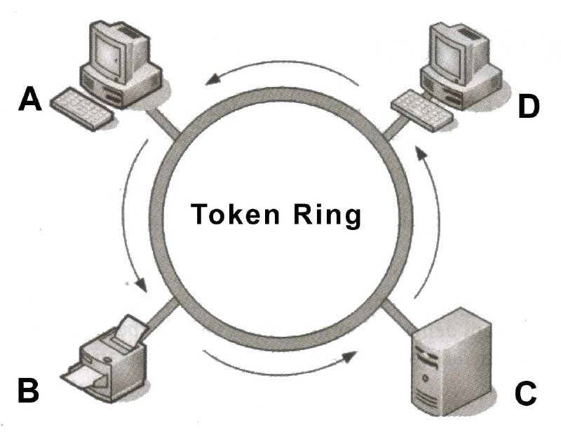
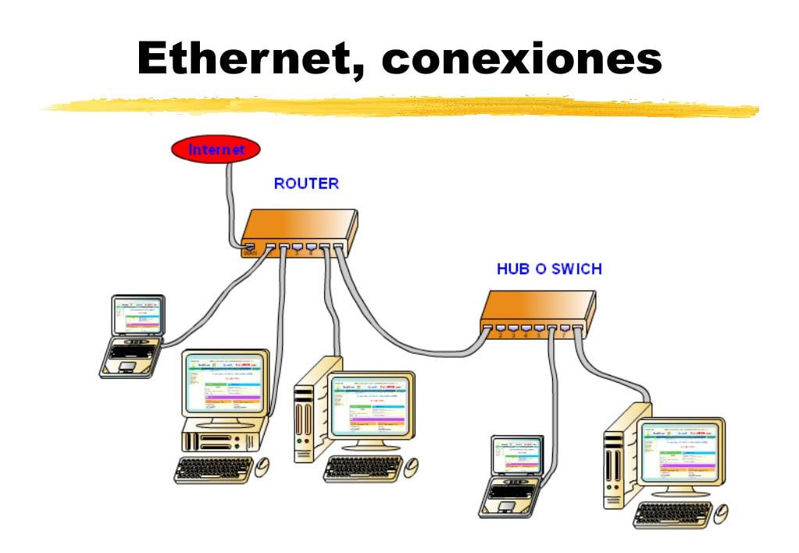
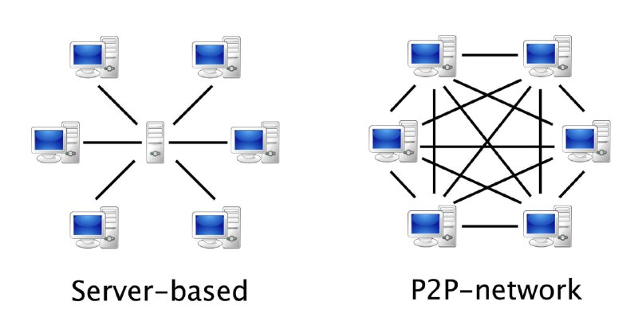

---
## Front matter
lang: ru-RU
title: Обзор архитектур распределенных систем и локальных сетей
subtitle: РОССИЙСКИЙ УНИВЕРСИТЕТ ДРУЖБЫ НАРОДОВ
author:
  - Устинова В. В.
institute:
  - Российский университет дружбы народов, Москва, Россия
date: 15 апреля 2025

## i18n babel
babel-lang: russian
babel-otherlangs: english

## Formatting pdf
toc: false
toc-title: Содержание
slide_level: 2
aspectratio: 169
section-titles: true
theme: metropolis
header-includes:
 - \metroset{progressbar=frametitle,sectionpage=progressbar,numbering=fraction}
---

## Докладчик

:::::::::::::: {.columns align=center}
::: {.column width="70%"}

  * Устинова Виктория Вадимовна
  * студент НПИбд-01-24
  * Российский университет дружбы народов
  * [1132243111@pfur.ru](mailto:1132243111@pfur.ru)
  * <https://github.com/vikauustin>

:::
::: {.column width="30%"}

:::
::::::::::::::

# Оглавление

## Cодержание {#cодержание .TOC-Heading .unnumbered}

[1. Вводная часть](#вводная-часть)

[2. Цель, гипотеза, задачи исследования](#цель,-гипотеза,-задачи-исследования)

[3. Содержание исследования](#cодержание-исследования)

[4. Анализ и практическая значимость достигнутых результатов](#анализ-и-практическая-значимость-достигнутых-результатов)

[5. Выводы](#выводы)

## Вводная часть
*Введение*:

Ключевую роль -> во всех сферах деятельности

Обработки транзакций -> управления производственными процессами

Традиционные централизованные системы уступают -> распределенным системам и локальным сетям

*Актуальность* изучения архитектур распределенных систем и локальных сетей обусловлена:

 * Ростом данных и масштабируемостью
 * Отказоустойчивостью и доступностью
 * Облачными вычислениями
 * Производительностью и эффективностью
 * Развитием IoT

## Объект и предмет исследования
• Объект исследования: Информационные системы, функционирующие на базе
распределенных архитектур и локальных сетей.

• Предмет исследования: Архитектуры распределенных систем (клиент-сервер,
пиринговые, облачные, микросервисные) и локальных сетей (Ethernet, Wi-Fi, Token
Ring), их характеристики, принципы функционирования, преимущества и
недостатки, а также их взаимодействие.

{#fig:001 width=31%}

## Научная новизна

:::::::::::::: {.columns align=center}
::: {.column width="70%"}

**Научная новизна** заключается в:

 * Систематизации классификаций
 * Сравнительном анализе
 * Выявлении тенденций развития

**Практическая значимость работы**:

Результаты исследования могут быть использованы:

 * Разработчиками программного обеспечения
 * Системными архитекторами
 * Сетевыми администраторами
 
:::
::: {.column width="40%"}

:::
::::::::::::::

## Цель, гипотеза, задачи исследования

:::::::::::::: {.columns align=center}
::: {.column width="70%"}

**Цель**: Предоставить всесторонний обзор архитектур распределенных систем и локальных сетей, выявить их ключевые особенности и области применений.

**Задачи исследования**:

• Изучить основные архитектуры распределенных систем: клиент-сервер,
пиринговые, облачные, микросервисные.

• Исследовать различные типы локальных сетей: Ethernet, Wi-Fi, Token Ring.

• Провести сравнительный анализ

:::
::: {.column width="40%"}

:::
::::::::::::::

## Содержание исследования

| Распределительные системы | Локальные сети |
| :--------: | :--------: | 
| 1. Клиент-серверная архитектура | 1. Ethernet              |
| 2. Пиринговая архитектура (P2P) | 2. Wi-Fi                 |
| 3. Облачные архитектуры         | 3. Token Ring (устарела) |
| 4. Микросервисные архитектуры   |                          |
| {#fig:002 width=40%} | {#fig:004 width=40%} |

## Сравнение архитектур систем

| Принцип | Архитектуры | 
| :--------: | :--------: | 
| Масштабируемость | P2P и облачные-наилучшей масштабируемостью| 
| Отказоустойчивости | Облачные и микросервисные-высокой | 
| Сложности реализации | Микросервисные-высокой квалификации| 
| Стоимости | Облачные архитектуры-экономичными| 

{#fig:003 width=40%}

## Сравнение локальных сетей

:::::::::::::: {.columns align=center}
::: {.column width="70%"}

| Принцип | Архитектуры | 
| :--------: | :--------: | 
| Безопасности | Wi-Fi-протоколы шифрования (WPA2, WPA3).| 
| Дальности действия | thernet ограничен длиной кабеля, Wi-Fi - мощностью сигнала. | 
| Пропускной способности | Ethernet обладает наибольшей пропускной способностью.| 
| Сложность | Token Ring > Wi-Fi > Ethernet |

•   Ethernet: Для проводных сетей, где важна скорость и надежность.
•   Wi-Fi: Для беспроводных сетей, где важна мобильность.
•   Token Ring: Устаревшая технология, практически не используется в современных сетях

:::
::: {.column width="35%"}

:::
::::::::::::::

## Анализ и практическая значимость достигнутых результатов

:::::::::::::: {.columns align=center}
::: {.column width="70%"}

Анализ полученных данных позволяет сделать вывод о том, что выбор архитектуры распределенной системы и локальной сети должен основываться на тщательном анализе требований к конкретному приложению или системе. Не существует универсального решения, подходящего для всех случаев. 

:::
::: {.column width="30%"}

:::
::::::::::::::

## Выводы
 
В заключение, данный доклад предоставляет обзор ключевых архитектур
распределенных систем и локальных сетей, их сильных и слабых сторон, а также
областей применения. Выбор архитектуры распределенной системы и сетевой технологии – это не просто техническое решение, это искусство баланса между потребностями и компромиссами.Идеальный выбор – это не слепое следование моде, а осознанное проектирование, основанное на глубоком понимании требований конкретной задачи, доступных ресурсов и допустимых ограничений. Нужно уметь взвешивать все "за" и "против", чтобы возвести наиболее эффективное и надежное "здание" информационной системы.

