---
## Front matter
lang: ru-RU
title: Индивидуальный проект
subtitle: Первый этап
author:
  - Устинова В. В.
institute:
  - Российский университет дружбы народов, Москва, России
date: 06 марта 2025

## i18n babel
babel-lang: russian
babel-otherlangs: english

## Formatting pdf
toc: false
toc-title: Содержание
slide_level: 2
aspectratio: 169
section-titles: true
theme: metropolis
header-includes:
 - \metroset{progressbar=frametitle,sectionpage=progressbar,numbering=fraction}
---

# Информация

## Докладчик

:::::::::::::: {.columns align=center}
::: {.column width="70%"}

  * Устинова Виктория Вадимовна
  * студент НПИбд-01-24
  * Российский университет дружбы народов

:::
::: {.column width="30%"}

:::
::::::::::::::

# Цель работы

Выполнение первого этапа индивидуального проекта о создании  персонального сайта научного работника, создать и выгрузить на github шаблон сайта

# Задание

Установить необходимое программное обеспечение.
Скачать шаблон темы сайта.
Разместить его на хостинге git.
Установить параметр для URLs сайта.
Разместить заготовку сайта на Github pages.

## Загрузка и перенос файлов

Загружаем файл hugo из гитхаба

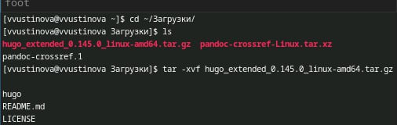{#fig:001 width=70%}

## Загрузка и перенос файлов

Переносим файл в /usr/local/bin

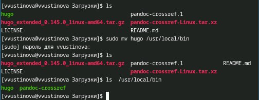{#fig:002 width=70%}

## Создание репозитория

Создаем репозиторий на гитхабе

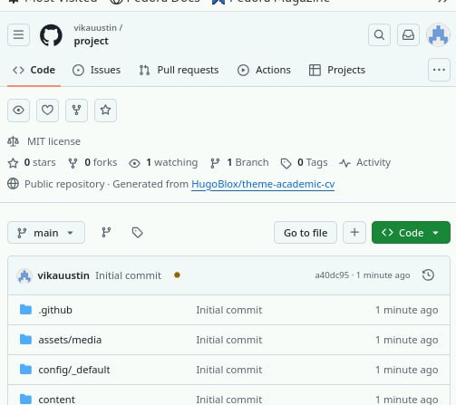{#fig:003 width=70%}

## Создание репозитория

Переходим в рабочий каталог и клонируем туда репозиторий новый

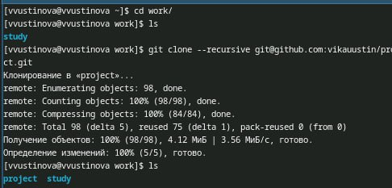{#fig:004 width=70%}

## Создание репозитория

Переходим в папку проекта и смотрим содержимое

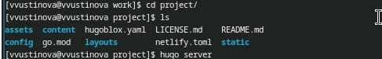{#fig:005 width=70%}

## Устиановка go

Необходимо установить go

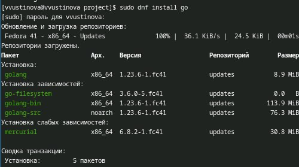{#fig:006 width=70%}

## Создание сайта

Используем одну из основных команд для создания сайтов

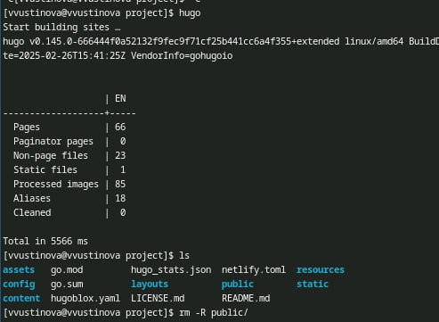{#fig:007 width=70%}

## Создание сайта

Запускаем команду hugo server, чтобы получить ссылку

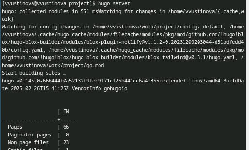{#fig:008 width=70%}

## Создание сайта

командо выполнилась успешно и мы копируем ссылку и запускаем ее

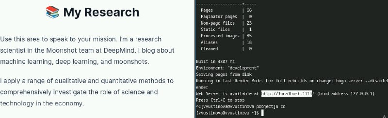{#fig:009 width=70%}

## Создание нового репозитория

Создаем новый репозиторий для сайта

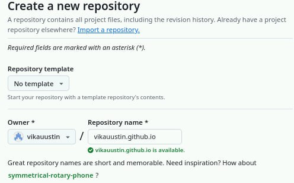{#fig:010 width=70%}

## Создание нового репозитория

Переходим в рабочую папку и клонируем его туда, создаем ветвь и добавляем в репозиторий файл

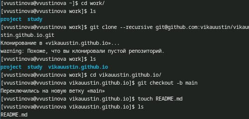{#fig:011 width=70%}

## Создание нового репозитория

Отправляем первый файл в пустой репозиторий

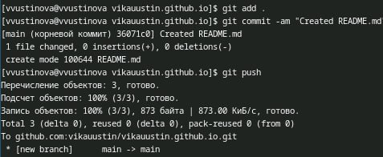{#fig:012 width=70%}

## Создание нового репозитория

Переходим в первый репозиторий и используем команду git submodule чтобы сохранить один репозиторий в качестве подкаталога другого

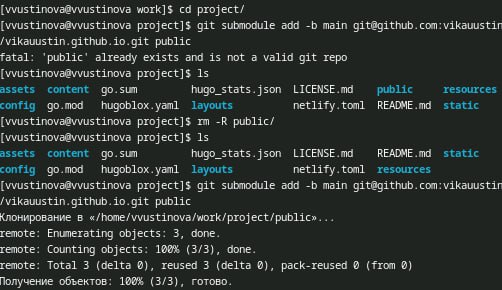{#fig:013 width=70%}

## Отправка на github

Отправляем все файлы на гитхаб

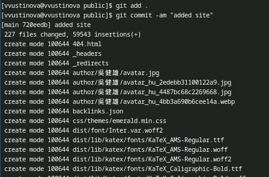{#fig:014 width=70%}

## Отправка на github

Используем команду git push для отпарвки

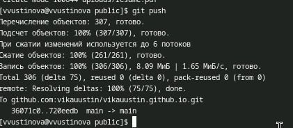{#fig:015 width=70%}

# Выводы

Выполнение первого этапа индивидуального проекта о создании  персонального сайта научного работника прошло успешно, а также получилось создать и выгрузить на github шаблон сайта, под своей ссылкой.

