---
## Front matter
lang: ru-RU
title: Индивидуальный проект
subtitle: Второй этап
author:
  - Устинова В. В.
institute:
  - Российский университет дружбы народов, Москва, России
date: 18 марта 2025

## i18n babel
babel-lang: russian
babel-otherlangs: english

## Formatting pdf
toc: false
toc-title: Содержание
slide_level: 2
aspectratio: 169
section-titles: true
theme: metropolis
header-includes:
 - \metroset{progressbar=frametitle,sectionpage=progressbar,numbering=fraction}
---

# Информация

## Докладчик

:::::::::::::: {.columns align=center}
::: {.column width="70%"}

  * Устинова Виктория Вадимовна
  * студент НПИбд-01-24
  * Российский университет дружбы народов

:::
::: {.column width="30%"}

:::
::::::::::::::

## Цель работы

Добавить к сайту данные о себе.

## Задание

Добавить данные о себе.
Написать два поста, один по прошедшей неделе, второй по выбору.

## Заменяем фотографию на собственную

Разместить фотографию владельца сайта. 

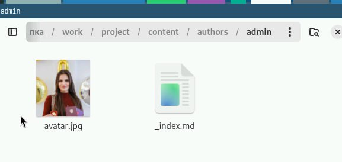{#fig:001 width=70%}

## Заменяем данные о себе

Заполняем основные данные о себе

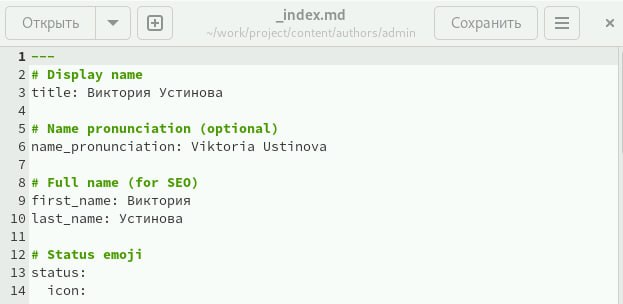{#fig:002 width=70%}

## Заменяем данные о себе

Добавить информацию об интересах (Interests).Добавить информацию от образовании (Education)

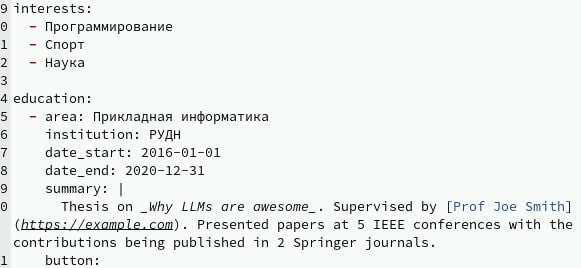{#fig:003 width=70%}

## Заменяем данные о себе

Редактируем основной текст про About me на основном экране

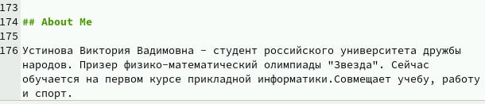{#fig:004 width=70%}

## Заменяем фотографию на выбранную

Находим папку git - started

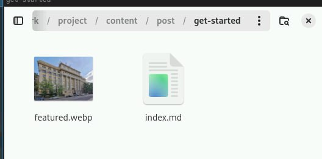{#fig:005 width=70%}

## Редактируем пост

Заполняем пост по прошедшей неделе

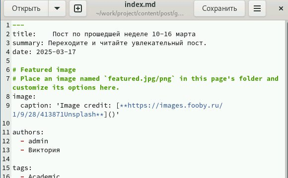{#fig:006 width=70%}

## Редактируем пост

Пишем пост

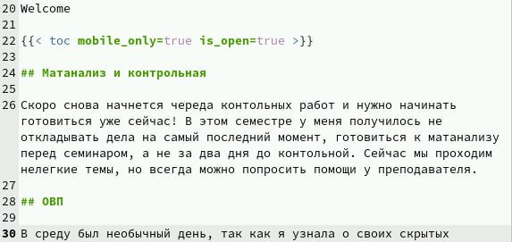{#fig:007 width=70%}

## Редактируем пост по выбору

Второй пост по выбору стал про git

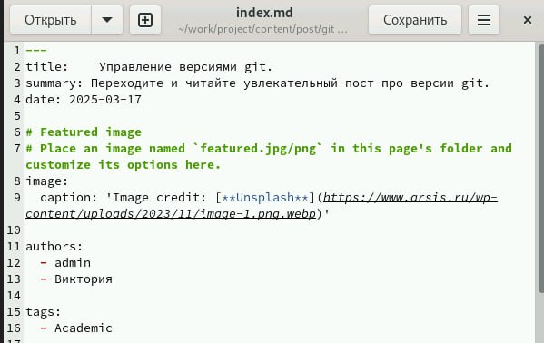{#fig:008 width=70%}

## Редактируем пост по выбору

Нужно заполнить пост основной информацией

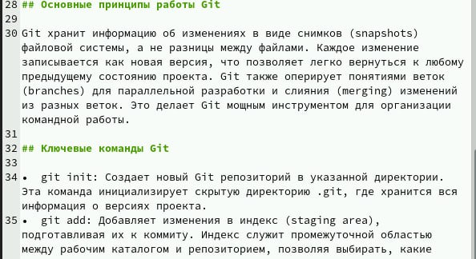{#fig:009 width=70%}

## Запуск сайта

Запускаем сайт

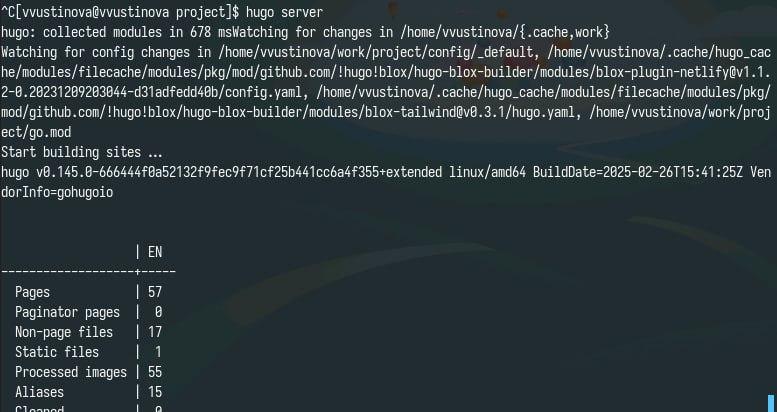{#fig:010 width=70%}

## Персональный сайт

Проверяем как создался сайт

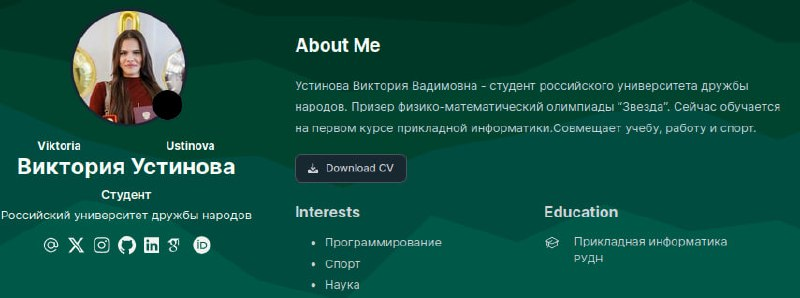{#fig:011 width=70%}

## Персональный сайт

Подкаталоги welcome кликабельны

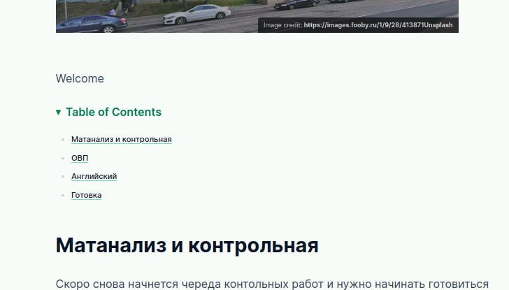{#fig:012 width=70%}

## Персональный сайт

Пост про версии git.

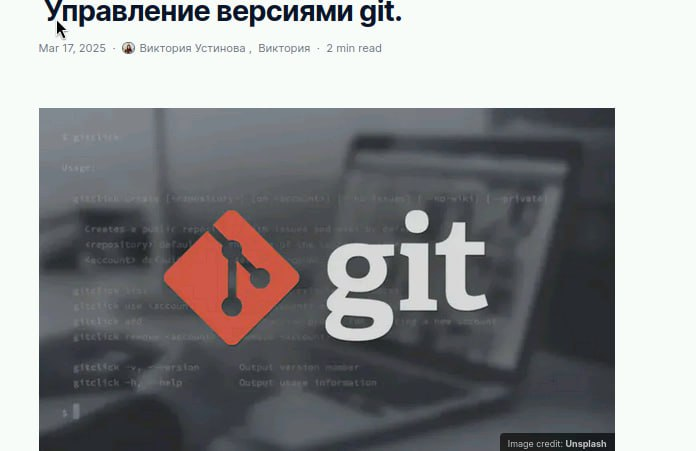{#fig:013 width=70%}

## Выводы

Выполнение второго этапа индивидуального проекта о создании  персонального сайта научного работника прошло успешно, а также получилось дoбавить к сайту данные о себе.
