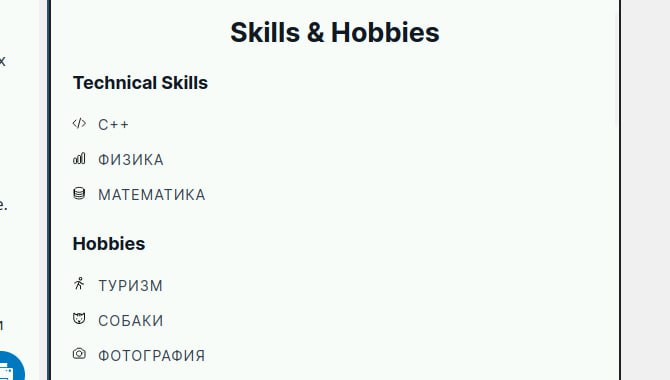
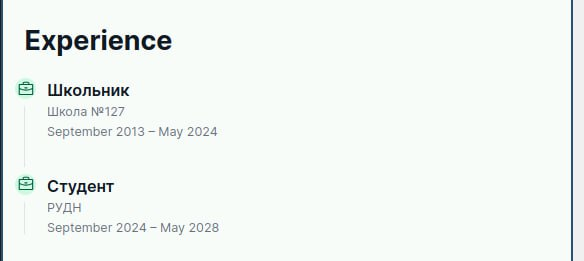
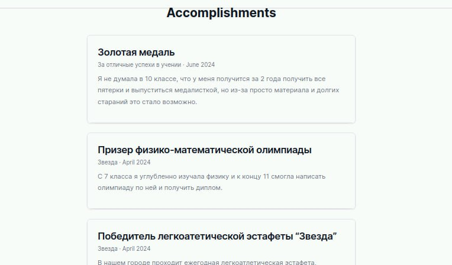
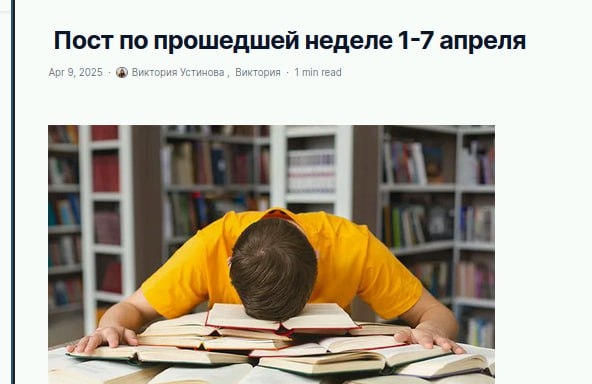
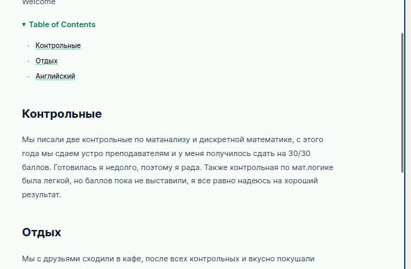
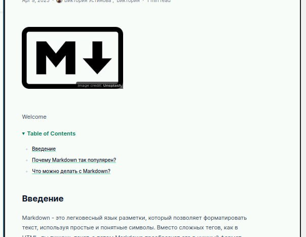

---
## Front matter
lang: ru-RU
title: Индивидуальный проект
subtitle: Третий этап
author:
  - Устинова В. В.
institute:
  - Российский университет дружбы народов, Москва, России
date: 11 апреля 2025

## i18n babel
babel-lang: russian
babel-otherlangs: english

## Formatting pdf
toc: false
toc-title: Содержание
slide_level: 2
aspectratio: 169
section-titles: true
theme: metropolis
header-includes:
 - \metroset{progressbar=frametitle,sectionpage=progressbar,numbering=fraction}
---

# Информация

## Докладчик

:::::::::::::: {.columns align=center}
::: {.column width="70%"}

  * Устинова Виктория Вадимовна
  * студент НПИбд-01-24
  * Российский университет дружбы народов

:::
::: {.column width="30%"}

:::
::::::::::::::

## Цель работы

Написать посты, добавить данные.

## Задание

Добавить к сайту достижения.Сделать пост по прошедшей неделе.
Добавить пост на тему по выбору.

## Добавить к сайту достижения

Добавить информацию о навыках (Skills)

{#fig:001 width=70%}

## Добавить к сайту достижения

Добавить информацию об опыте (Experience)

{#fig:002 width=70%}

## Добавить к сайту достижения

Добавить информацию о достижениях (Accomplishments)

{#fig:003 width=70%}

## Добавить к сайту пост

Сделать пост по прошедшей неделе

{#fig:004 width=70%}

## Добавить к сайту пост

Сделать пост по прошедшей неделе

{#fig:005 width=70%}

## Добавить к сайту пост

Добавить пост на тему по выбору:Легковесные языки разметки.Языки разметки. LaTeX.Язык разметки Markdown.

{#fig:006 width=70%}

## Выводы

Мы успешно выполнили данные нам задания.

